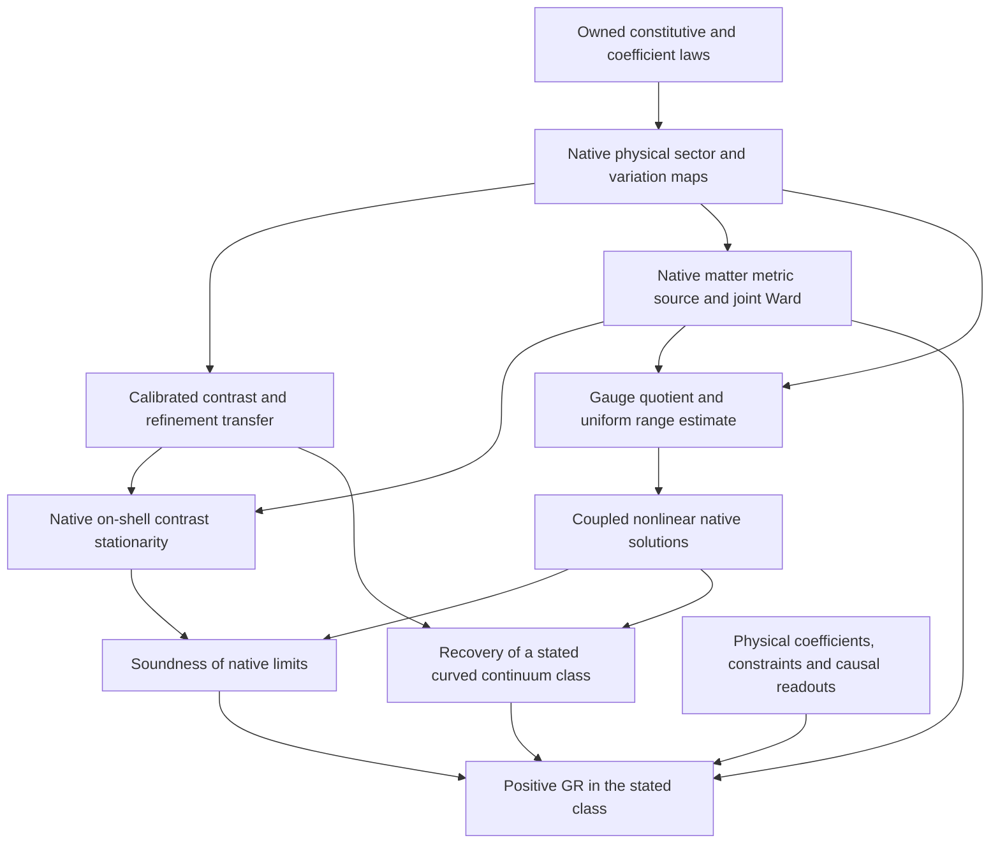

# Native realization: owned equations, scoped obstructions and gravity dependencies

Task: `EXP-A4D-JOINT-RESPONSE-DECOUPLING-MICROSTRUCTURE`, Draft PR #310.
Research input: `af221e2fed92821c52afc88a5500774de8cd9a93`.
Control baseline: `fa2b04b9c8aae5a0b8470322d6091712ce56567a`.
Status: first native variational gate investigated; **positive GR and global
closure remain OPEN**. This artifact does not promote claims or retire tasks.

The October 6 audit report and the chat summaries were investigative inputs,
not instructions to change a mathematical definition or a release status.
The implementation follows the user's explicit closure plan. Its first
completed result is the [affine prepared-contrast obstruction](A4D_NATIVE_AFFINE_PROBE_NOGO.md),
which is stronger than direct action nonidentification but has its own
explicit class. A complete D0-core obstruction has not been proved.
The [signed-quadratic/Gram and literal flux follow-up](A4D_NATIVE_QUADRATIC_GRAM_FLUX_BOUNDARY.md)
removes the positivity assumption for quadratic profiles, supplies an
exactly affine curved Gram pencil, and derives the actual flux action's
local coframe source and full joint gate.
The [weighted-trace/moving-lift follow-up](A4D_NATIVE_WEIGHTED_TRACE_LIFT_BOUNDARY.md)
tests actual variable weights in their inverse-density volume coordinate,
classifies all exact linear lifts between adjacent canonical cycles, and
separates the complete compensator gate from auxiliary-only elimination.
The [volume-fiber obstruction](A4D_NATIVE_VOLUME_FIBER_OBSTRUCTION.md)
then removes polynomial and fixed-operator restrictions whenever all native
geometric data still depend only on physical volume density. A curved
straight Gram pencil preserves that density pointwise but has Einstein
contrast `3*pi^2/50`. The actual compensator's auxiliary-only gate has a
unique action value, so nonlinear elimination cannot recover missing shape
under this explicit input condition.

The [reference-weight classification](A4D_NATIVE_REFERENCE_WEIGHT_BOUNDARY.md)
now treats an actual shape-sensitive family outside the volume-only class.
Every coefficient fails raw Lorentz scalar descent, with uniform defect
5/86 on two fixed probes. The two owned coefficients have different kernels
and range bounds; this is an operator classification, not a new native action.

The [spectral-frame result](A4D_NATIVE_SPECTRAL_FRAME_BOUNDARY.md) excludes
nonconstant scalar spectral repair of the literal flux operator on the
declared full frame class. The existing quadratic spectral energy has a
sharp normalized frame defect at least 1/8 on two fixed genuinely curved
metrics, uniformly in its coefficient and every L in 4N. General functions
that vary with refinement retain an explicit collapsing-response exception.

The [literal vector action/source classification](A4D_NATIVE_VECTOR_SOURCE_BOUNDARY.md)
now binds the existing commutator kinetic action to its actual derivative
and supplied-source equation. Its full free field gate has zero curvature
and background response. The complete finite source range and joint
conjugation identity are proved, while a bounded nonsingular background
family with fixed compatible source has inverse norm delta^-2 and response
norm 4 delta^-3. Its kernel cannot all be treated as gauge. These finite
results do not supply a physical metric/source/readout map.

## 1. State, action, variation and source are separate owners

The following inventory records the actual definitions/propositions, rather
than treating comments or theorem names as physical equations.

| Owner | Independently defined data and variations | Actual equation/result | Source and refinement | Missing physical arrow |
|---|---|---|---|---|
| `D0.Geometry.ArchiveSeamCurvature`, `ArchiveVariation` | Fixed canonical fine/coarse cycle Laplacians and fixed cyclic lift; coarse symmetric row-sum-zero `LaplacianVariation` | $D=L_fJ-JL_c$; $S=\|D\|^2$; $\delta D=-J\delta L_c$; `ArchiveStationary` quantifies over those variations | `J` comes from `archiveRGPhaseProjection`; its phase index is not the four-Role product | No variable metric/coframe/link sector is constructed here. The old `local_support : Prop` field does not enforce a support equation. |
| `ArchiveLocalLaplacianVariation` | Genuine edge conductance variations, with off-diagonal support zero away from adjacency | Exact conductance/local-Laplacian variation equivalence | Same cyclic phase carrier | This fixes locality of a variation, not an Einstein action or physical Role readout. |
| `ArchiveFieldEquation` | Gradient $G_h=-2J^TD$ and supplied symmetric conserved `ArchiveStressSource` | `SourcedArchiveEquation` is $G_h=T$; it implies its variational pairing form | $T$ is a structure argument; no matter Euler action is defined by the implication | The unprojected canonical gradient is nonsymmetric; Section 2 excludes its equality with every such $T$. |
| `Matter.GeneratedMatterSource` | `MatterRep` is supplied | The generated scalar source is identically zero by definition | Anomaly-free neutrality follows; the record of a localization no-go consists of `True` fields | It does not derive a nonzero local matter source or a dynamical coupling. |
| `Matter.ArchiveStressCoupling` | Supplied `MatterRep` | $T=\mathrm{anomalySum}(R)L_c$; symmetry/conservation; anomaly-free $T=0$ | No native matter action, metric variation or physical ten-component stress map | A zero archive matrix is not a nonlinear matter-source realization on the Role carrier. It does not exclude curved Ricci-flat vacuum solutions in a different owned system. |
| `Matter.LocalTraceSource` | Supplied operator with `trace_eq_anomaly` | Diagonal density sums to its supplied trace; trace zero implies neutrality | The operator's localization is an input | No canonical local operator or metric Euler stress is constructed. |
| `Matter.MatterLocalizationNonuniquenessNoGo` | Neutral completions on `Fin 2`; two explicit different local sources | Total zero readout is `M1Forced`; local neutrality does not choose a local distribution | Completion relation already requires total zero | This owns total neutrality, not a local source or its metric derivative. |
| `Frozen.ConservedStressProjection` | Supplied matrix with divergence hypothesis | Symmetric conserved projection is pairing-equivalent on constrained variations | No matter action supplied | Projection cannot replace the derivation of stress or turn the stronger full matrix equation into a theorem. |
| `Geometry.ArchivePrimalDualMovingAction` | Supplied perfect pairing, primal equivalence and map $S$ | Dual action is inverse transpose; passive moving $S$ is unchanged precisely on its stabilizer | Operator covariance | Neither the pairing nor $S$ is selected as a physical metric Hodge law by this theorem. |
| `FinitePrimalDualHodgeParent`, `A4DPathWordParentWard` | Supplied primal/dual differentials, stars, pairing and fields $\psi,\chi,\lambda$; all operator variations retained | A concrete mixed quadratic/constraint action and its Ward identity under the declared covariance hypotheses | Moving differentials and constitutive variations are inputs to the hypotheses | A physical metric-dependent star, matter interpretation and coupled Euler/source law remain to be derived. This action is not covered by assuming a fixed positive seam norm. |
| `Gravity.A4DParentWardStressDescent` | Supplied `df`, `readout`, coframe Euler and auxiliary Ward terms | Divergence zero follows **if** parent Ward, auxiliary EOM, coframe EOM and readout constraint all hold | Exact finite centered-gradient adjoint is owned | The physical parent Ward and EOM hypotheses are not proved by the descent theorem. |
| `Gravity.VariationalCarrierAudit` | Supplied graph Laplacian satisfying `IsGraphLaplacian` | Response defined as $2L$ is symmetric and has zero row divergence | Finite matrix identity | The capstone does not quantify over all variational carriers or identify $2L$ with a physical Einstein tensor. |
| `Geometry.SpectralActionAdmissibility` | Supplied `ArchiveHeatTrace4D`; cutoff and stable-signature hypotheses | Named expansion/curvature slots are conjunctions of the supplied dimension condition and exponent equalities | Structural admissibility | No actual heat expansion coefficient, nonlinear metric variation or curvature-action equality is proved. |
| `Geometry.HeatTraceEHProxy`, `HeatTraceA2Decomposition` | Supplied symmetric `L` and positive site weights `rho`; actual volume coordinate is `mu=1/rho` | Exact off-diagonal sum quadratic in `mu`; second owner's convention has factor 1/2 | Exact trace-square decomposition and positivity | Bounded-degree fixed-operator profiles fail the earlier pencil. The stronger volume-fiber result excludes arbitrary nonlinear volume-only operators/profiles too, when the explicitly tested physical-volume readout and shape probe are admitted. Additional shape data remain outside that class. |
| `Geometry.ArchiveHeatTrace` | Fixed archive cardinality/eigenvalue `x.val` and supplied heat time `u` | A positive finite exponential sum and point-lift compatibility | No density or metric argument in its actual definition | At fixed `u` the metric contrast is zero. This is not a heat trace of a variable weighted Laplacian. |
| `Geometry.ArchiveLaplacianRG`, `ArchiveSeamCurvature` | Fixed modulo point-map lift; continuous lift variations are an enlarged candidate class, not an owned native sector | All exact linear intertwiners between adjacent canonical cycles have rank at most one; the unital case is the constant projector | No injective unital root under the full continuous-lift gate | Local support restrictions are a genuine exception: an exact constrained rank-three root with action 3/4 is exhibited. Degenerating injective approximate lifts also prevent a uniform approximation no-go. |
| `Gravity.A2CompensatorNoether` | Unsigned incidence, positive weights, independent edge and vertex fields; rational finite owner | Full edge gate iff residual zero. Auxiliary-only gate is always nonempty with a unique action value, despite kernel roots; both statements compiled in Lean | Off-shell Ward and auxiliary normal equation are owned | Auxiliary elimination can give a rational, nonquadratic profile. If all external geometry inputs depend only on volume density, its unique value is nevertheless blind to the exact volume-preserving shape probe. A shape-sensitive edge/incident input needs a separate physical map. |
| `Geometry.A4DDiscreteEnergyKernel` | Actual counting cochain field and uncentered coframe; full free variations in both | `E=<psi,(1+H(e))psi>/2`; complete joint unsourced gate iff `psi=0`, arbitrary coframe | Exact local 16-slot coframe source derived in the follow-up; no separate physical connection variable | Curved zero-field joint roots fail Einstein stationarity; literal scalar-sector action/field gate fails the owned nonlinear Lorentz quotient. Additional combined actions or restricted sectors need independent owners. |
| `Geometry.A4DLocatedMatterCellEnergy` | Existing supplied weights `W_c=I+H(e)+c M_q(e)` on full uncentered coframes; no independent action added here | Generic scalar block and actual exterior-unit binding; all c fail raw Lorentz descent with sharp two-probe defect 5/86 | At `e=-I/2`, c=1 has one constant scalar kernel and range gap O(L^-2); c=2 has uniform gap 1/2 | A shape-sensitive weight need not descend to physical metric data. Coefficient dependence changes kernel/range, but neither coefficient supplies a physical source/Ward or native action. |
| `Geometry.A4DConstitutiveKernelClassification` | Supplied symmetric `H`, field and unselected `alpha`; `Q=1+H+alpha H^2` | Existing strict positivity for `alpha>1/4` forces zero field at its full field gate; at `alpha=1/4` kernel fields have zero first operator source | No coefficient or physical matter law is selected | The candidate binding H=actual flux matrix fails raw Lorentz action descent for every alpha, even on two fixed curved backgrounds. Other maps into supplied H remain open. Field-only roots do not imply a zero pointwise source. |
| `Algebra.GaugeKineticPositivity`, `Matter.GaugeCurvatureOrigin`, `Matter.VectorOperatorOrigin` | Existing `-c Tr([D,A]^2)` on finite real skew matrices, nonzero c, full independent field variations | Actual first variations and supplied-source gate compiled; full free gate iff `[D,A]=0`; its background response `[A,[D,A]]` is zero | Supplied skew J is solvable iff orthogonal to the commutant; actual simultaneous-conjugation Ward proved. No physical refinement is defined | A physical D(g) and local metric source are not selected. Constant rank and bounded/nonsingular D do not yield a uniform inverse: exact fixed-source family has inverse delta^-2. Kernel shifts may change background response without changing sourced value and need not be gauge. |
| `Gravity.A4DLinearizedMetricResponse` | Finite Euclidean symmetric tensor seed and literal linear response | Quadratic action, exact first variation and gauge nullity | Algebraic finite construction, explicitly not an Einstein tensor | A standalone quadratic affine metric profile cannot reproduce the nonlinear third variation of the curved Gram pencil. |
| `D0-A4D-SECOND-ORDER-ENERGY-COVARIANCE-001` owners | Supplied reference weight, second jet and covariance/composition hypotheses | Exact second-order identities and explicit coefficient nonselection | Finite algebraic covariance | The registry's current notes correctly retain the supplied Hessian, unselected coefficient and absent physical Einstein/stress interpretation. |
| `A4D_NATIVE_FINITE_PROBE_COMPLETION.md` | Physical coframe/links and the naked-star action; independent endpoint preparations with full 24-row residual bound | $T_{h,h^{1/3}}=DI(g)[V]+O_V(h^{2/3})$, all ten slots, owner curvature sign | Constructed archive record/operator refinement; independently fixed affine source | A measured action law is not native on-shell stationarity, a native source or physical state/variation mapping. |

The inventory is limited to the gravity arrows actually consumed here. It is
not an exhaustive classification of every action or nonlinear representation
in all of D0. The precise hypotheses are part of the result, not a claim that
a nearby comment supplies them.

## 2. An actual canonical archive on-shell obstruction at every nontrivial stage

This is a separate, completely specified native-owner class. It is not a
negative terminal for the physical #310 source problem.

Put $m=n+2\ge3$. The canonical coarse/fine cycles have lengths $m,m+1$;
$J_{ij}=1_{j=i\bmod m}$. Computing each row gives

\[
 D_{0,*}=-e_0^T+e_{m-1}^T,\qquad
 D_{m,*}=-e_0^T+e_1^T,\qquad D_{i,*}=0\ (0<i<m).          \tag{1}
\]

For interior rows both transports have the same neighbors and degree two.
At the two end rows their difference is exactly as displayed. The argument
also covers $m=3$: the two nonzero columns remain distinct. Thus
$\|D\|^2=4$ at every $n\ge1$.

The legitimate local edge variation $\delta L=(e_0-e_1)(e_0-e_1)^T$ is
symmetric, row-sum zero and supported on the edge $\{0,1\}$. Its first
variation is

\[
 -2\langle D,J\delta L\rangle=-2(-1-2)=6.                  \tag{2}
\]

The $-1$ term is the first end row, the $-2$ term the last end row; all
other rows of $D$ vanish. Therefore the **actually defined canonical**
`ArchiveStationary n` and `VacuumArchiveEquation n` are false for every
$n\ge1$. This does not exclude variable-Laplacian sectors.

There is an independent obstruction to the stronger sourced matrix equation.
By (1), $G=-2J^TD$ has only row zero nonzero:

\[
 G_{00}=4,\quad G_{01}=G_{0,m-1}=-2,\quad G_{10}=0.         \tag{3}
\]

It has row sums zero but is **not symmetric**. Every `ArchiveStressSource`
has a symmetric matrix. Consequently no such source satisfies the owned
canonical `SourcedArchiveEquation n T` for any $n\ge1$, even before
anomaly cancellation is used. In particular the anomaly-free generated
source, which is zero, cannot make these canonical stages on shell.

The variational equation only tests $G$ on its allowed tangent space and
is weaker than $G=T$. Its symmetric conserved representative may differ
as a matrix. Replacing the full equation by that quotient equation would
change a definition; this implementation does not do so.

Equations (1)--(3) are a general analytic proof at all $n\ge1$.
The [affine checker](certificates/a4d_native_affine_probe_nogo_check.py)
replays selected stages only as exact algebraic controls. Empty canonical
on-shell fibers are recorded as an obstruction to this owner, **never** as
a nonvacuous positive realization or as #310's required exact hostile family.

## 3. Which mechanism has actually passed or failed

| Mechanism | Outcome | Extent |
|---|---|---|
| Flattened archive number/record section | Constructed | Compatible records/operators and a specified golden measure; no physical Role-state action/Euler identification |
| Direct fixed-fine seam/Palatini action transfer | Scoped obstruction | Actual coarse seam variations versus literal flat stationary Palatini sign paths |
| Joint affine fine/coarse with fixed $J$, affine metric fibers, full auxiliary gate | Scoped obstruction | Completed contrast transfer with one calibration is impossible on the two smooth probes at the same explicit curved metric; null directions and arbitrary refinement dimension are allowed |
| Arbitrary signed quadratic action with full affine auxiliary gate, over the specified metric or raw-coframe pencil | Stronger scoped obstruction | Every stationary value is quadratic even at indefinite saddles and with kernels. A curved pencil has affine raw coframe and affine Gram metric but a strictly nonzero Einstein third variation; no positivity or differentiation of errors is used |
| Merely small native Euler residual | Insufficient | Requires a proved profile-value/range estimate; the exact checker exhibits an $O(h^2)$ residual and value gap one |
| Fixed-operator weighted traces with a bounded polynomial degree and the stated physical inverse-density volume map | Scoped obstruction | Every native profile has bounded degree on the curved Gram pencil, while every Einstein derivative of order at least two is nonzero. Degree growing with refinement, moving operators and auxiliary elimination are excluded from the class |
| Arbitrary volume-only geometric data and single-valued or uniquely auxiliary-stationary native action profiles | Stronger information-class obstruction | A straight curved Gram pencil has the same full pointwise volume at every parameter but Einstein contrast `3*pi^2/50`. Nonpolynomial spectra, density-dependent operators/refinement and actual unique-value compensator elimination remain blind to that probe |
| Full free unital linear-lift variation on adjacent canonical cycles | Exact solution-set classification | The unique stationary lift is the rank-one constant projector. No injective full-gate root exists; local constraints and degenerating approximate lifts are protected exceptions |
| Native metric-shape readout, shape-sensitive local/nonlinear constraints or moving operators | OPEN | The restricted classifications do not exhaust these. A compatible native action/variation owner and quantitative refinement map are still needed; dependence on volume alone cannot supply this information |
| Existing homogeneous mixed-parent action with bilinear pairing and full field gate | Scoped obstruction | Even arbitrary nonlinear metric dependence of the supplied operators leaves every stationary action value zero; this blocks its standalone completed-contrast realization. A singular-root control prevents inferring pointwise metric stress zero. |
| Existing standalone cochain `fluxEnergy` with full free coframe/field gate | Exact solution-set classification | All and only `(e,0)` are joint solutions at every stage. Explicit curved Gram readouts have zero native source but nonzero Einstein variation. A proper rational boost also changes the scalar-sector action and field equation at fixed Gram metric |
| Existing positive-weight A2 compensator with full independent edge gate | Exact solution-set classification | Residual, action and diagonal response vanish. Auxiliary-only stationarity does not give this conclusion and is not excluded as a nonlinear profile mechanism |
| Spectral functions of the literal flux matrix with the actual scalar/exterior sector | Scoped obstruction | Exact scalar frame descent forces a fixed spectral function to be constant. The existing quadratic spectral action retains normalized defect at least 1/8 on two fixed curved conformal metrics for every coefficient and every L in 4N. Arbitrary refinement-dependent spectral functions may collapse while preserving a flat first jet; they are not covered by the uniform quadratic bound. |
| Literal real-skew vector kinetic action, full free field and supplied-source range | Scoped finite classification | Derivative, full commutant kernel and finite source sufficiency are proved. Unsourced background response is zero; the exact conjugation Ward is not yet a metric divergence identity. Uniform inverse fails on an explicit bounded nonsingular family. |
| Native matter metric variation and joint Ward identity | OPEN | Existing total neutrality/zero-source/conditional Ward results do not construct this system |

The smallest remaining first-stage obligation is a typed native physical
state/variation/action realization outside the now excluded quadratic,
volume-only information, standalone full-gate and literal-flux spectral classes, or
a completeness theorem for the remaining core-owned mechanisms.
Nonlinearity of the Gram readout alone
does not discharge it. A map must precede a native
solver: solving the independently declared naked-star physical system alone
would not prove this native arrow.

## 4. Minimal dependency graph for the positive gravity conclusion

The companion [graph](A4D_NATIVE_GRAVITY_DEPENDENCIES.json) records scopes,
hypotheses, owners, verification and intended terminal class. Its OPEN nodes
are proof obligations, not externally closed passports. The graph is a
gravity critical path, not an asserted complete graph of all 889 registry
rows. No independent blocker count is inferred from its number of nodes.

After the maps are owned, the solver must permit corrected metrics
$Q_h=g(hx)+\delta Q_h$, $\delta Q_h\to0$, and solve the full
metric--connection--matter system. It must distinguish genuine gauge from
response-null directions, split the range and kernel/cokernel, bound the
needed range uniformly, and solve the remaining nonlinear equation. No
exact-sampling obstruction is substituted for this corrected-metric problem.

Soundness must use actual native on-shell sequences. Recovery must construct
such a sequence for every solution in the stated continuum class, including
at least one truly curved physical realization. The curved probe base of
the present no-go is an off-shell geometric test, not that realization.

M1 physical representation assumptions enter only if the chosen native map
uses `PhysicalComparisonRepresentation.Representation`. Its faithful laws,
injectivity and realization of proper subcomparisons then need their own
construction. The raw toy representation and abstract transport theorem do
not discharge that physical instantiation.

The constant-rank hypothesis of the cited PDE-constrained Young-measure
theorem must be proved for the chosen operator/class if that theorem is
used. The present no-go uses finite orthogonal projection and direct
smooth differentiation, not that theorem. It supplies no constant-rank
assertion at the resonance divisor.

## 5. Preserved parent terminals and scientific status

* **#310**, input `af221e2fed92821c52afc88a5500774de8cd9a93`:
  original fixed independently declared smooth source, exact samples,
  refining full joint/source roots, designated comparator and unweighted
  raw norm remain its terminal. The completed probes and native scoped
  obstructions are separate finished research parts. Parent remains Draft.
* **#202**, inspected `224ccb2c66ed4e64cb29c24f2845eb383f2ae8f0`:
  separate four-channel full-affine curved stationary witness/scoped no-go.
  Its inspected failed CI run `37458519329` timed out during a research
  certificate; timeout does not refute its mathematics. No new result here
  consumes or replaces its terminal.
* **#317**, inspected `745bb0739b105e21c28d4dc5d4675726fce3deae`:
  complete absolute complex divisor/rank-stratum obligation remains open.
  Main contains the reviewed arithmetic/Hodge slice. Full complex
  stratification enters the GR path only if an actual map/solver uses it.

The twelve declaration diagnostics are reconciled separately in
[the kernel/semantic audit](A4D_NATIVE_OWNER_BINDING_AUDIT.md). A proved
numeric scaffold cannot be upgraded by a same-named alias into an operator
refinement or curvature theorem.

Under the [canonical closure contract](../CLOSURE_CONTRACT.md), the present
scoped obstruction is a research boundary theorem awaiting CONTROL intake.
It closes its explicit affine mechanism. Global zero-unclassified-ambiguity
closure and positive GR are not claimed. The core is unchanged.
