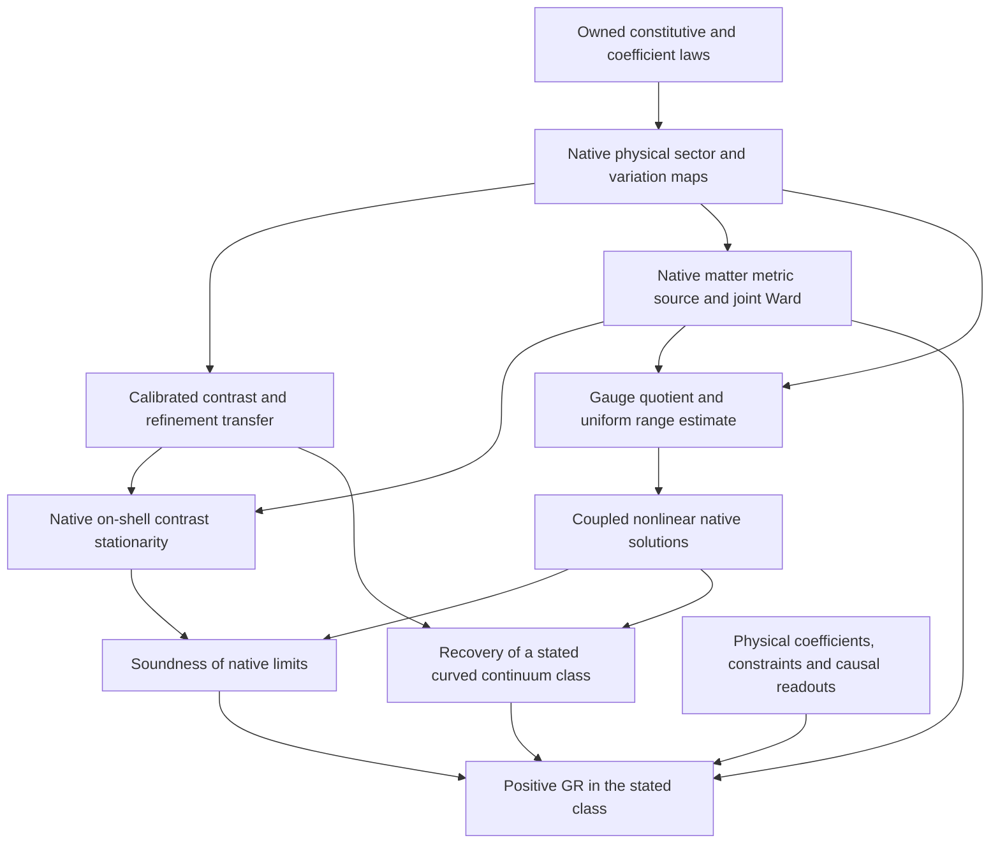

# Native realization: owned equations, scoped obstructions and gravity dependencies

Task: `EXP-A4D-JOINT-RESPONSE-DECOUPLING-MICROSTRUCTURE`, Draft PR #310.
Research input: `af221e2fed92821c52afc88a5500774de8cd9a93`.
Control baseline: `fa2b04b9c8aae5a0b8470322d6091712ce56567a`.
Status: first native variational gate investigated; **positive GR and global
closure remain OPEN**. This artifact does not promote claims or retire tasks.

The active route is now the [native-core execution plan](D0_NATIVE_CORE_EXECUTION_PLAN_2026-10-08.md).
Its first [history/response result](A4D_NATIVE_HISTORY_RESPONSE_DESCENT.md)
constructs the full-future quotient and the realized observation tower with
actual surjective truncations and commuting process maps. The owned golden
recording gate proves that identical system AND archive marginals can give
a two-return Z gap of `-8*p^6`, without inserting another blank record.
Complete archive return, all-source Schur reconstruction and the archive
determinant variation are retained. The package also consumes the
actual profinite finite-factorization owner for the full response, proves
compact realization of compatible histories, and constructs the isometric
golden cylindrical inclusion with reversible blank-factor preparation.
Forty-two propositions compile and 189 exact controls pass. The subsequent G0b slice below binds the joint feedback operator and records
the exact action/source scaling. The full physical complement law remains open. The earlier regular time-field
intertwiner classification remains a scoped control, not the route owner.

The [composed-feedback proof](A4D_NATIVE_COMPOSED_FEEDBACK_DYNAMICS.md)
now has 215 compiled propositions and 670 exact controls. In addition to the
complete golden-active-block joint class and native composed-action gap,
it classifies every compatible fine readout projector as `JPJ^T+S`, with S
an orthogonal projector on the preparation complement. For the image-supported
test, the full return `C=J^T U_word J` determines the action with the exact
missing-norm correction `P(I-C^T C)P`. The actual moving preparation, operator
and readout source is transported. Analytic finite action-error bounds retain
rank and resolvent constants. The literal cylinder pullback is replicated
`L(P)` and includes the complementary active range; replacing it by the
image filter changes a child-point reading by `p^2`. The remaining G0b input
is the complete joint scene return law and its admitted variations under
that actual readout. No new measurement, action or physical dynamics is selected.

Two actual golden preparations, J and GJ, now reconstruct every full
new-layer operator from all four signed cross-return blocks. The literal
cylinder action and its genuine derivative are consequently determined,
including the previously hidden complementary source. The all-size
reconstruction bound has factor 1/(1-|a|). Full physical cross-return access,
the joint scene law and its admitted metric/link/matter variations remain
the next native inputs; diagonal probabilities alone are insufficient.

The new recorded-quadratic construction obtains the feedback action directly
from the owned golden comparer, a retained preparation flag and normalized
event probabilities. The complete orthogonal operator and its explicit
internal three-stage program compile. Both comparison records and the old
target memory are preserved. One fixed factor two calibrates the mixed
reading; no inverse-U or signed-U oracle is required for this component.
The true moving derivative and dimension/rank/resolvent-sensitive action
bounds are retained. The next physical input is the joint scene law and
its admitted pair preparation/common execution/readout/variation interface,
including the separate bootstrap heat-trace term. No G0 or GR closure follows.

The whole-bootstrap follow-up now derives the genuine thermal covector
and the coupled first variation, with direct binding to the existing scene
heat coefficients. Raw binary replication keeps the heat covector and
doubles feedback; a coarse stationary variation transfers exactly when the
fine heat covector doubles. A fixed connected-Laplacian/Cayley slice has a
proved stationary point and nonstationary replicated image. This control
keeps its zero mode and is not a full native joint root. The next arrow is
the owned joint Delta/P/U tangent law and actual spectral transition that
decide this condition on the complete admitted domain. No thermal trace,
temperature rule, source prescription or physical action is selected.

The operator/source follow-up binds the actual source-port definitions and
differentiates the shared degree/adjacency chain through active plane,
compression, trace normalizer, both ports and the Q8 interaction. Complete
retained word jets and all weighted feedback terms are derived. The native
pairing and its inverse move together. Actual matrix heat differentiation
includes moving noncommuting eigenvectors; general C1 finite operator
heat/Jacobi calculus has a self-contained analytic proof. Whole-action
covariance gives a genuine basis Ward, with exact controls rejecting a
frozen normalizer or frozen pairing. This does not supply a physical
metric/matter Ward or native on-shell gate. The next input is the owned
joint primitive state/tangent and full scene spectral refinement law,
using these derived source arrows. No physical variable or source is fitted.

The spectral-history follow-up (§6.8) classifies the complete finite operator
class preserving both actual golden histories: it is precisely literal
replication. The full intertwining defect reconstructs every spectral change;
the second-history defect equals the tick/scene commutator when the first is
natural. Conditional genuine derivatives and exact first-jet contractions
expose the needed thermal-memory response. Pointwise spectral compatibility
does not imply source compatibility, and nonzero response-null defects remain.
Passivity itself is not proved native. The next actual owner must compute both
defects and their jets from the same admitted primitive history as P and the
full word, without fitting a complement or adding an action/physical postulate.

The [fixed complete golden limit](A4D_NATIVE_GOLDEN_FIXED_CALIBRATION.md)
now derives a unique unit success limit from the same literal retained
seed and word. Complete unconditional squared state error is <=16^(-k)/8
without an archive-size factor. Faithful injective real state/operator
encoding preserves the entire word and error; every real orthogonal
projector reading has squared error <=16^(-k)/2. The actual p0/all-33-scene
corollary and all golden pair-history depths are bound in the kernel.
Common unspin is the existing inverse G^(16*k) on one pointer. The target
keeps its derived per-vertex phase; it is not fitted or silently positive.
Real pointer phase visibility and the scoped real-entry invariant reject
a universal phase-gauge shortcut. The packet has 86 new compiled
propositions, 12 D0 pins and 154 exact controls. Physical controller/readout
admission, native budget and the same joint heat/tangent/action law remain
the next G0b input. No native source/Ward, stationarity, GR or parent
terminal is promoted.

The [complete retained golden preparation](A4D_NATIVE_GOLDEN_HISTORY_PREPARATION.md)
now constructs the literal 2^45 seed and every complete recursive word,
with actual incoming scene histories and degrees 20/22/24. It derives
G^8 from the owned golden gate, failure <=16^(-k)/10 after two initial
stages, and a whole-vector squared error <=16^(-k)/5 against the explicitly
phase-preserving normalized successful target. The expanded syntax has
an inverse-square failure/cost bound; its identification with native
MDL/kappa is still open. Whole-cylinder prefix extension intertwines at
every depth and preserves the full error. Single fine-blank phases fail.
The actual successful phases for degrees 20 and 24 have nonzero relative
area, so a common phase cannot supply the physical isometry. The packet
has 151 compiled actual propositions, 12 D0 pins and 239 exact controls.
Boolean/address and relative-phase physical admission, native budget and
heat/tangent/action ownership remain the next G0b inputs. No source/Ward,
stationarity, G0b, GR or original terminal is promoted.

The new [complete joint-history extension (§6.10)](A4D_NATIVE_COMPOSED_FEEDBACK_DYNAMICS.md#610-complete-joint-readout-extensions-and-their-actual-source-relevance)
constructs the full generated projector and operator and classifies every
symmetric two-readout completion as A0 plus a unique supported complement.
The actual cardinality and traces 718/65/653, nonempty complement,
reversal covariance and genuine scalar heat derivative are compiled.
All joint graph relabelings leave exactly 19 complementary parameters,
or 13 with reversal symmetry, by complete exact orbital equations.
Those parameters can affect the full heat action while readouts and
feedback stay fixed. The standalone packet has 158 compiled propositions,
30 D0 pins and 246 exact controls. Book 03's default 33-vertex heat trace
is retained; this finite completion class is not installed as a native
heat law, scalar tangent admission or condensed refinement. The next
owned arrow must derive the actual heat carrier and admitted state,
tangent and refinement before source/stationarity transfer. No original
terminal, G0 or GR is promoted.

The new [owned scene-history realization (§6.9)](A4D_NATIVE_COMPOSED_FEEDBACK_DYNAMICS.md)
constructs the actual 718-history reversal and endpoint/source readouts.
It derives full feedback J(I-T^2)C and the coarse polynomial
I-T^2=2*Delta-Delta^2 for the existing normalized scene Laplacian. All
archive-delay kernels and all full-word returns are proved; all 30
balanced archive directions return after two operations. A joint
relabeling preserves both scene and record, so the vertex-only equivariant
no-go does not exhaust history dynamics. The standalone packet has 60
compiled propositions, 30 D0 source pins and 246 exact controls, including
the ordinary determinant reduction and a nonempty actual feedback witness.
The unobserved 653-dimensional complement is retained. The next arrow
is physical admission, the actual heat carrier and spectral law, and
golden-compatible refinement of this same joint state, with its complete
admitted tangent law. No full-bootstrap stationarity, local metric/matter source/Ward,
curved solution or GR closure follows from this finite operator relation.

The [G0 primitive-interface proof](A4D_NATIVE_DYNAMICAL_OWNERSHIP.md)
now answers a necessary ownership question directly, without adding another
candidate family or graph node. It classifies every actual `ActionProtocol`,
proves the canonical representative uniquely pointwise least, and exhibits
normalized relative costs that differ under every relabeling and calibration.
It also classifies every invariant background scalar on a symmetry quotient
and eliminates the unused geometric-action premise of the actual conditional
Ward theorem. These are complete statements for those interfaces. A complete
native physical state/action/variation/readout/refinement family, or its
complete boundary, is still the single remaining G0 target. Physical response
nonuniqueness and full-core impossibility are not inferred from cost freedom.
The same G0 package now completely classifies the actual polynomial
composition premise. Its Dg=0 slice requires G cubed zero, excluding the
owned length-four constant generator. The compiled order-two replacement
retains the explicit higher-order remainder and requires only K=G squared+Dg.
A full real exponential flow is a control for this distinction. No Dg law,
simultaneous native groupoid or constitutive action is thereby constructed.

The same [G0 ownership proof](A4D_NATIVE_DYNAMICAL_OWNERSHIP.md#6-complete-flat-translation-lift-family-including-its-stabilizer)
now classifies the complete simultaneous flat-translation transport fiber,
including isotropy and arbitrary symmetric second jets. It binds the
integrability criterion directly to the literal four-role/Fock constant
generators. Different normalized transports have an explicit abstract
intertwiner; it is not automatically an owned physical gauge map.
The complete metric consumer is now determined: the literal flat metric
image has rank 4(L^4-16) for every L in 4N; testing it is exactly centered
divergence zero, with a compiled nonzero smooth metric covector proving
that this is not full metric stationarity. The entire flat orbit has only
flat smooth nondegenerate limits under strong L2 coframe convergence.
Further U/Hessian choices cannot repair either limitation. G0 must supply
the native action and independent Euler equations on the full existing
coframe/link carrier, including transverse metric variations and physical
refinement. No new graph node or parent terminal is introduced.

The [primitive cost variation theorem](A4D_NATIVE_DYNAMICAL_OWNERSHIP.md#21-the-whole-primitive-cost-fiber-has-an-exact-infinitesimal-boundary)
now classifies the entire direct ActionProtocol-to-field-derivative route.
An identity-based primitive cost is continuous exactly when the state germ
is locally constant; a faithful nonzero coframe variation cannot provide a
genuine derivative at fixed nonzero calibration. Lean's zero totalized
`deriv` at a nondifferentiable point is explicitly excluded as stationarity.
All real centered finite readings remain possible, and a shrinking-gap family
approximates any nonnegative target profile with uniform error delta.
The independently owned history-composition/normalization law is therefore
the remaining premise; finite probes and continuum limits are not ruled out.
This consumes the accepted A-PARENT boundary and adds no new action or task.

The [external G0 result review](A4D_EXTERNAL_G0_RESULT_REVIEW_2026-10-07.md)
extends the literal constant scalar-cycle cubic obstruction to every n>=3.
It corrects the report's derivative variable and single-probe injectivity
claim, and refutes both implications of its proposed isotropy/readout
dichotomy. All 50 submitted PASS records replay, but are not accepted as
proof of that dichotomy. The independent package compiles 20 propositions
with two D0 source pins and replays 38 exact controls. The accepted results
do not make abstract frame freedom native gauge or prove physical D0
nonuniqueness. The [next theory specification](D0_THEORY_TASK_NEXT_2026-10-07.md)
retains the complete owned state/action/variation/readout/refinement target.

The [complete scene-history consumer](A4D_NATIVE_HISTORY_ACTION_BOUNDARY.md)
now classifies every additive scalar on the literal all-walks carrier and
its full unit-gap edge restriction. It separates the 32-dimensional endpoint
boundary space from the 685-dimensional kernel of actual C1 averaging and
proves their complete decomposition with the constant reading. Positive,
automorphism-invariant controls preserve C1 while changing equal-length,
equal-endpoint action values. The unique infinite nonnegative endpoint-central
trace is proved analytically with an explicit contraction, and its literal
Perron logarithmic reading telescopes exactly to length plus boundary in Lean.
These are complete history-interface results; own field-dependent composition,
physical source, admitted variations and refinement remain to be constructed.
The [supplementary external review](A4D_EXTERNAL_G0_SUPPLEMENT_REVIEW_2026-10-07.md)
accepts corrected prior formulas and the exact 1828-dimensional coframe
quotient at L=4 from existing full rank theorems. Its 49 PASS include a hidden
unconditional-success check. Raw curl excludes forward translations, not all
physical gauge. No G0, GR or original parent status is changed.

The October 6 audit report and the chat summaries were investigative inputs,
not instructions to change a mathematical definition or a release status.
The implementation follows the user's explicit closure plan. Its first
completed result is the [affine prepared-contrast obstruction](A4D_NATIVE_AFFINE_PROBE_NOGO.md),
which is stronger than direct action nonidentification but has its own
explicit class. A complete D0-core obstruction has not been proved.
The [signed-quadratic/Gram and literal flux follow-up](A4D_NATIVE_QUADRATIC_GRAM_FLUX_BOUNDARY.md)
removes the positivity assumption for quadratic profiles, supplies an
exactly affine curved Gram pencil, and derives the actual flux action's
local coframe source and full joint gate.
The [weighted-trace/moving-lift follow-up](A4D_NATIVE_WEIGHTED_TRACE_LIFT_BOUNDARY.md)
tests actual variable weights in their inverse-density volume coordinate,
classifies all exact linear lifts between adjacent canonical cycles, and
separates the complete compensator gate from auxiliary-only elimination.
The [volume-fiber obstruction](A4D_NATIVE_VOLUME_FIBER_OBSTRUCTION.md)
then removes polynomial and fixed-operator restrictions whenever all native
geometric data still depend only on physical volume density. A curved
straight Gram pencil preserves that density pointwise but has Einstein
contrast `3*pi^2/50`. The actual compensator's auxiliary-only gate has a
unique action value, so nonlinear elimination cannot recover missing shape
under this explicit input condition.

The [reference-weight classification](A4D_NATIVE_REFERENCE_WEIGHT_BOUNDARY.md)
now treats an actual shape-sensitive family outside the volume-only class.
Every coefficient fails raw Lorentz scalar descent, with uniform defect
5/86 on two fixed probes. The two owned coefficients have different kernels
and range bounds; this is an operator classification, not a new native action.

The [spectral-frame result](A4D_NATIVE_SPECTRAL_FRAME_BOUNDARY.md) excludes
nonconstant scalar spectral repair of the literal flux operator on the
declared full frame class. The existing quadratic spectral energy has a
sharp normalized frame defect at least 1/8 on two fixed genuinely curved
metrics, uniformly in its coefficient and every L in 4N. General functions
that vary with refinement retain an explicit collapsing-response exception.

The [literal vector action/source classification](A4D_NATIVE_VECTOR_SOURCE_BOUNDARY.md)
now binds the existing commutator kinetic action to its actual derivative
and supplied-source equation. Its full free field gate has zero curvature
and background response. The complete finite source range and joint
conjugation identity are proved, while a bounded nonsingular background
family with fixed compatible source has inverse norm delta^-2 and response
norm 4 delta^-3. Its kernel cannot all be treated as gauge. These finite
results do not supply a physical metric/source/readout map.

The [mixed-parent source classification](A4D_NATIVE_PARENT_SOURCE_BOUNDARY.md)
now separates its zero stationary values from its actual pointwise source.
For a positive scalar form, every full field root has zero constitutive
response, for arbitrary supplied differential operators. The invertible
indefinite class instead has a completely specified kernel/source relation
and image radical. An approximate-root estimate is sharp at square-root
residual order under its stated uniform bounds. No physical star is selected.

The same [parent proof, Section 6](A4D_NATIVE_PARENT_SOURCE_BOUNDARY.md#6-complete-field-frame-class-full-background-source-and-joint-roots)
now classifies its complete invertible field-frame freedom on arbitrary
backgrounds. The exact off-shell source defect contains all three actual
matter residuals; it vanishes on the full gate for every background direction.
All joint roots with the same geometric action correspond. Fixed seeds
transported solely by field frames have zero full source, including singular
and indefinite forms. This removes a
representation parameter without erasing transverse seed dependence: equal
operator values with distinct transverse first jets have an exact surviving
source difference one. No native gauge/refinement admission or physical
nonuniqueness is inferred. Uniform approximate-source control additionally
requires a bound on the frame's logarithmic derivative. The parent package
has 32 compiled declarations and 75 exact controls; G0 stays open.

The [verification/process and phase-refinement classification](A4D_NATIVE_VERIFICATION_REFINEMENT_BOUNDARY.md)
now determines the strength of the actual formal verification interface:
verifiability is equivalent to a nontrivial empirical quotient, and literal
point-test process runs are precisely bijections. Exact reversible processes
on every level of the one-dimensional phase tower are identities. The full
subsequence classification retains nontrivial sparse-level processes; a
half-turn family has adjacent error 1/L but composed error 1/2. These results
specify constraints on proposed native arrows without supplying a physical
action or identifying phase points with spacetime sites.

The [actual local-source quotient and range construction](A4D_NATIVE_EDGE_SOURCE_QUOTIENT.md)
now proves the full stress-readout equivalence on the real four-Role local
variation space. The source representation Gram is c^2(2I+A^T A), with
sharp lower bound 2L^4 and condition number 9 for L>=3. Its retained raw
kernel is explicit. This finite source-representation inverse is not the
coupled physical Euler inverse. Separately, two phase edge tests exclude
every actual anomaly-sum source alpha C_L at even the weaker variational
gate, with sharp unscaled squared residual 18. Signed reconstructed sources
are a protected exception; the native matter action is still missing.

The [nonlinear log-det source classification](A4D_NATIVE_LOGDET_SOURCE_BOUNDARY.md)
now derives the real scalar variation and complete finite source image for the
specified signed local-conductance binding on its positive resolvent domain.
A prescribed source is realizable exactly when its scaled edge data admit a
positive definite centered completion; its root is unique. A three-vertex
exact family has bounded positive source and diverging inverse response.
Both nonzero coupling signs are classified, including a uniform finite
negative-coupling control on the unit four-Role family. The full unsourced
edge gate is empty. Arbitrary supplied profiles can encode arbitrary actions,
so this finite source theorem does not select a native physical law. More
generally every full convex affine-metric-fiber profile fails the two curved
Einstein probes, extending the earlier quadratic obstruction.
The actual coordinate-edge operator with direct nodal field readout also has
a weak mixed-response gap `pi^2/20` on an explicit curved Lorentz metric.
An exact periodic corrector with field size O(h) and mixed response `-9/20`
protects the broader prepared-field class from that obstruction. Separately,
the bare positive log-det class with uniformly bounded positive conductances,
controlled probe sensitivity and two specified flat preparation maps cannot
retain a nonzero curved contrast after the required flat calibration. This
last result permits nonlinear preparation and spatially oscillating weights;
its flat-map and uniform-bound hypotheses are not inferred from the core.

The [positive point-state/refinement classification](A4D_NATIVE_MEASURE_REFINEMENT_BOUNDARY.md)
now exhausts all positive normalized states on the actual coordinatewise
Role-point observable diagram, with arbitrary correlations. Compatible
families are summable mixtures on countable histories; every weak volume
limit under arbitrary point placements or shrinking positive local kernels
is atomic. A vanishing total composed TV error preserves this result.
For direct or uniformly nearby nodal placement, the weaker requirement of
consistency on fixed smooth doubling probes permits only delta_0; a smooth
positive density has an explicit fixed probe gap at least m/32. This does
not infer state consistency from the Einstein contrast estimate. Merely
vanishing adjacent errors, macroscopic nonlocal kernels, signed functionals,
field-state spaces and the distinct flattened archive remain outside the
excluded class. The independent eight-atom archive measure is preserved.

The [centered native metric/variation construction](A4D_NATIVE_CENTERED_METRIC_LIFT.md)
now gives an explicit part of the missing state map. Row midpoint preparation
of a smooth invertible solder realizes the actual centered Gram metric and
all ten smooth symmetric probes with O(h^2) error and uniform preparation
bounds. The full centering range inverse and its high-frequency loss are
classified; the old rank result is reused. An exact nonlinear fiber criterion
keeps its Lorentz/Nyquist constraints, rather than assuming every finite
metric has a lift. For the literal standalone flux action the construction
gives exact levelwise zero-field roots with an explicitly curved non-Einstein
limit, zero native contrast and physical half-contrast
`-(3*pi^2/50)*h^(1/3)+O(h)`. This excludes the stated full levelwise gate/readout
class. Native interlevel admission is not proved or built into that gate.
The constructive kinematics therefore does not complete the joint native
metric-connection-matter or refinement/action/source arrows.
For the separately specified componentwise actual scalar pullback, all
smooth nondegenerate metric limits are constant Lorentz matrices; constant
zero-field flux roots realize the whole stated limit class. The approximate
extension requires bounded raw L2 preparation and vanishing composed L2
defects. The curved midpoint family fails that compatibility with squared
field gap 1/80 and metric gap 1617/32000 although adjacent errors vanish.
This does not select that transition as a physical native gate.
The separate owned graded one-form lift yields a zero metric limit in
measure if applied to the full solder, and only eta if applied to its
perturbation. These exact composed classes do not yield curved recovery;
no L1 convergence or exclusion of concentrated energy is asserted.

The [native transported connection realization](A4D_NATIVE_TRANSPORTED_CONNECTION_REALIZATION.md)
now binds actual affine Lorentz pull links to physical link matrices and
classifies every finite transported-center fiber by its cycle holonomy.
The full joint raw/link variation is explicit, including its mixed term.
A half-transport midpoint construction gives corrected smooth metrics and
all ten metric and 24 connection variations, without a uniform grid inverse.
When the continuum connection is Levi-Civita, the actual corrected readout
enters the existing all-24-row O(h^2) physical preparation domain. This is
kinematic realization, not a native action identity or an on-shell solution.
Even nontrivial holonomy cannot supply a mesh-independent full inverse for
even near-identity cycles; all affine shifts and raw kernels are retained.
Twenty compiled propositions with 50 transitive source pins and 162 exact
controls keep action/source/refinement transfer and the physical Ward open.
The standalone flux gate with unconstrained spectator links still has exact
curved zero-field roots: transported readout alone cannot change its zero
native contrast into the nonzero physical Einstein contrast. This scoped
levelwise result does not assume additional connection/interlevel gates.
For the already specified scalar/graded native arrows, near-identity links
do not remove the refinement obstruction: scalar smooth limits stay constant,
and graded full/perturbation limits stay zero/eta in measure. The bounded-raw
L2 version has explicit transported Gram error at most (Ch+C^2h^2/4)B^2.
The exact flat joint differential also distinguishes metric-only reachability
from independently prescribed metric/link targets; the latter retains the
even-grid cokernel 4L^3+6L^2. Smooth approximate lifts do not remove it.

The [connection-action classification](A4D_NATIVE_CONNECTION_ACTION_BOUNDARY.md)
now excludes every explicitly coframe-blind factorization I_N(F,R,z)=Phi_h(R,z)
that admits the displayed smooth homothetic probes. Actual transported Gram
scaling realizes Q_h(t)=(1+t)Q_h(0) at fixed Levi-Civita links. Its native
contrast is zero for arbitrary Phi and coefficients, while the physical
half-contrast is -3*pi^2*h^(1/3)/50+O(h^(4/3)). O(h) recording/refinement
errors cannot repair the gap. The existing matrix Yang-Mills, supplied
Killing and seam functionals enter this class only under the explicitly
stated coframe-independent argument binding. Prepared links are not
declared native roots. Own coframe dependence and independently owned
constraints remain protected exceptions. The literal Lorentz trace square
has signature (3,3); the Euclidean-skew positivity premise discards all
boosts, and a fixed Frobenius replacement fails Lorentz invariance.

For the explicitly tested matrix-action binding to odd plaquette curvature,
identity links and arbitrary raw coframes are exact full levelwise roots.
The curved midpoint readout is non-Einstein and one physical connection
Euler row/h tends to -2*pi/5, excluding the required O(h^2) preparation.
This does not include additional native or interlevel constraints.

The full Lorentz-invariant symmetric quadratic curvature family is also
classified: all nonzero coefficients have signature (3,3). More generally,
continuity and simultaneous Lorentz invariance force every connection-only
scalar to take its flat value on an entire curved common-null-generator
link sector. Only an additional differentiable global-minimum hypothesis
makes that sector stationary; zero indefinite action value is not enough.
This applies to nonlocal functions but not to coupled coframe/observer data.
For the actual indefinite matrix action, the complete common-null-generator
sector instead satisfies the full link gate exactly when its scalar curl
is zero. The transverse rows E=-2 Tr(NG) D^T D a are retained; zero action
alone never substitutes for the complete equations. The new package has
84 exact controls, including all 2304 factor tangents of the L=2 lattice.

The [coupled Hodge and exact scale-fiber result](A4D_NATIVE_COUPLED_HODGE_SCALE_BOUNDARY.md)
now treats actual coframe-dependent weights and dressed-link data outside
the coframe-blind class. Their uniform scale invariance remains exact.
Two curved metrics have exactly equal pointwise volume and explicit native
transported Gram fibers at every L in 4N, with different physical action
values. Hence any scale-invariant native coframe/link scalar plus an
arbitrary separate volume-density profile fails calibrated contrast
transfer; the paired gap is -9*pi^2*h^(1/3)/200+O(h^(4/3)). Neither bounded
volume sensitivity nor a polynomial profile is assumed. Eighteen compiled
propositions have 56 source pins. The all-size construction and smooth
contrast obstruction are analytical, with all ten metric components and
all 24 physical and native connection directions retained in exact controls.
The full coframe-dependent curvature-quadratic gate has exact identity-link
roots with curved metric readout; a nonzero separate constant volume term
instead makes its source-free full scale gate empty. The latter conclusion
does not extend to arbitrary nonlinear volume terms. Genuine mixed
scale/shape dynamics, probe restrictions and interlevel/matter equations
remain independent obligations; no new action is selected.

The [complete affine history scalar classification](A4D_NATIVE_AFFINE_HISTORY_SCALAR_BOUNDARY.md) consumes the actual field-path composition owner. A scalar depending only on total affine transport respects every native concatenation exactly when it is an affine character; the two-link realization and translation blindness are compiled. The whole real four-dimensional class is an additive function of log absolute determinant, with one logarithmic coefficient under continuity. On the full affine Lorentz group every such scalar vanishes, also proved without a GL extension. All 24 connection, 16 raw-coframe and ten metric rows vanish; the existing nonzero metric contrast therefore cannot transfer through this interface when its pencil is admitted. Context-dependent history weights, retained coframe/matter observables and nonadditive joint actions remain separate routes requiring their own native owners. This narrows the field-action construction without claiming G0 or whole-core closure.

The [complete joint field quotient](A4D_NATIVE_JOINT_FIELD_QUOTIENT.md)
now retains raw coframes, Lorentz links, affine shifts and all sixteen
exterior matter components. Its exact image and tangent space are constrained
by metric isometry across each dressed link, with explicit inverse formulas.
The actual transported center factors through these coordinates in Lean.
A full centered metric/link reading loses a nongauge Nyquist family; raw
information is therefore retained. A source must differentiate the owned
action along genuine constrained variations: arbitrary ambient extensions
can manufacture a nonzero metric derivative of a zero native action.
This is a constructive kinematic and variational interface result, with
15 compiled declarations, 51 transitive D0 pins and 41 exact controls.
It does not supply the missing field law, physical source/Ward or refinement,
and changes neither the 44 graph terminals nor the original parent goals.

The [complete nonnegative homogeneous source theorem](A4D_NATIVE_POSITIVE_SOURCE_JETS.md)
now eliminates arbitrary nonlinear positive-weight changes as a mechanism
for a nonzero source at full freely varied field roots in that stated class.
Its complete positive quadratic first/second jets retain cross blocks,
nonzero matter kernels and rank changes. The literal supplied squared-flux
action is bound to the theorem with its proved positivity hypotheses.
A bounded positive rational family disproves source control from small
Euler residuals alone. Its point source remains one while the normalized
h^(1/3) half-contrast tends to zero, so the joint limit cannot be replaced
by that point derivative. Uniform action-derivative bounds remain an actual
preparation obligation. This consumes earlier fixed-frame and positive-parent
results while preserving indefinite actions, nonhomogeneous potentials and
owned constraints as exceptions. Eighteen Lean propositions, 40 D0 pins and
114 exact controls do not select the required coupled action or refinement;
physical source/Ward, GR and all original terminals stay open.

## 1. State, action, variation and source are separate owners

The following inventory records the actual definitions/propositions, rather
than treating comments or theorem names as physical equations.

| Owner | Independently defined data and variations | Actual equation/result | Source and refinement | Missing physical arrow |
|---|---|---|---|---|
| `Foundation.EndogenousActionQuantum.ActionProtocol` | Every actual transition-cost assignment, with identity cost zero and nonidentity cost at least one | Complete continuity iff locally constant state theorem; genuine derivatives only on trivial germs. A faithful affine coframe encoding, if supplied, has no identity-cost derivative | All centered finite values are possible; shrinking-gap completions converge uniformly to arbitrary nonnegative profiles. No native history/refinement law is selected | A composition/normalization law must turn primitive histories into the field action before its Euler gate is used. Zero totalized `deriv` is not such a law. |
| `Foundation.VerifiabilityNecessity`, `EmpiricalTheoryFactorization` | Supplied empirical observations and verified equality protocol; actual `run` and `pullTest` compatibility | Formal verifiability iff nontrivial empirical quotient; point-test runs iff bijections, with generic Lean proofs | Full predicate tests instead admit arbitrary runs; exact all-level phase permutations are rigid, while subsequences and approximate composites have classified exceptions | A physical equality apparatus, state preparation and allowed physical variations are not selected by these interfaces. The actual native Dirichlet energy separates two verified preparations. |
| `Synthesis.ConcretePhysicalDetectorRepresentation`, `M1ClassAdmissibility` | Concrete member/value/history observations and independent two-sided catalogue histories | The class-level physical representation is constructed; admissible comparisons factor through both current inputs; primitive capability profiles are membership/value | Actual propositions and transitive axioms printed in the verification capsule | This existing result must be preserved. It is not a physical metric/action/source map or the stronger old faithful-capability representation of every comparison object. |
| `D0.Geometry.ArchiveSeamCurvature`, `ArchiveVariation` | Fixed canonical fine/coarse cycle Laplacians and fixed cyclic lift; coarse symmetric row-sum-zero `LaplacianVariation` | $D=L_fJ-JL_c$; $S=\|D\|^2$; $\delta D=-J\delta L_c$; `ArchiveStationary` quantifies over those variations | `J` comes from `archiveRGPhaseProjection`; its phase index is not the four-Role product | No variable metric/coframe/link sector is constructed here. The old `local_support : Prop` field does not enforce a support equation. |
| `A4DCoframeParentConstraint`, `A4DSolderMetricCompletion`, `A4DRawSolderFrameAction` | Actual free raw coframe field, directional average and centered nonlinear Gram map | Explicit smooth metric/probe lifts with O(h^2) corrections; complete linear centering range inverse and exact constrained nonlinear fiber criterion | Full finite raw kernel is retained. High-frequency inverse grows with L; smooth midpoint lifts have uniform bounds. The literal standalone flux gate has exact levelwise curved non-Einstein root families under this readout | Kinematic existence is not native interlevel admission, physical gauge, action transfer or a successful joint Euler solve. Arbitrary finite Gram-fiber feasibility is not asserted. |
| `ArchiveChainConnection`, `ArchiveAffineCartanConnection`, `ArchiveAffineExteriorLink`, `A4DRawSolderFrameAction` | Actual Lorentz affine pull links, free raw solder, transported center and independent shifts | Exact matrix/holonomy/torsion and joint-variation bindings; complete periodic transported-center range and fibers; smooth all-ten/all-24 geometry preparation | Even near-identity injective centering has full inverse at least 2/(Ch). Corrected physical connection residual is O(h^2) under the published probe premise; no physical refinement arrow is selected | Kinematic readout is not a native action law, source, joint stationary solution or centered-Cartan connection/Ward law. All raw/affine invisible directions are retained. |
| `ArchiveLocalLaplacianVariation` | Genuine undirected edge conductance variations on `ArchiveRolePhasePoint n`, with off-diagonal support zero away from Role-product adjacency | Exact conductance/local-Laplacian variation equivalence | Four-Role product carrier; this is distinct from the one-dimensional phase carrier of `ArchiveVariation` | This fixes locality on its actual carrier. The isomorphism cannot silently be used as a phase-seam or physical metric variation map. |
| `ArchiveLaplacianRG`, `ArchiveRolePhaseProductCarrier`, `A4DGoldenAFCommutativeTargetBoundary` | Actual phase projection, coordinatewise Role points and pointwise observable algebra; all positive normalized linear point states | Full compatible-state class is the countable-history probability simplex; point/local positive physical readouts cannot recover smooth volume. Finite state/pushforward and scalar Hodge-isometry equivalences compile | Exact compatibility or vanishing total TV error suffices for arbitrary point placements. Near direct placement, vanishing composed error on fixed smooth tests alone forces delta_0 | A state on point observables is not a field-configuration state. Neither action-contrast bounds nor nonlocal quadratic positivity imply these positive-state hypotheses. No native physical measure is selected. |
| `Probability.FiniteArchiveMeasure` | The literal rational eight-point cross with weights 1/8 | `archiveStageMeasure n` is independent of n and has eight atoms; both facts compile | Distinct from uniform Role-grid volume and the existing golden flattened-record measure | The actual finite measure does not by itself supply physical spacetime volume or its metric variation. |
| `ArchiveFieldEquation` | Gradient $G_h=-2J^TD$ and supplied symmetric conserved `ArchiveStressSource` | `SourcedArchiveEquation` is $G_h=T$; it implies its variational pairing form | $T$ is a structure argument; no matter Euler action is defined by the implication | The unprojected canonical gradient is nonsymmetric; Section 2 excludes its equality with every such $T$. |
| `Matter.GeneratedMatterSource` | `MatterRep` is supplied | The generated scalar source is identically zero by definition | Anomaly-free neutrality follows; the record of a localization no-go consists of `True` fields | It does not derive a nonzero local matter source or a dynamical coupling. |
| `Matter.ArchiveStressCoupling` | Supplied `MatterRep` | $T=\mathrm{anomalySum}(R)L_c$; symmetry/conservation; anomaly-free $T=0$ | No native matter action, metric variation or physical ten-component stress map. For fixed canonical phase cycles L>=3, two genuine local tests exclude every alpha C_L at the weaker variational gate | A zero archive matrix is not a nonlinear matter-source realization on the Role carrier. It does not exclude curved Ricci-flat vacuum solutions in a different owned system. |
| `Matter.LocalTraceSource` | Supplied operator with `trace_eq_anomaly` | Diagonal density sums to its supplied trace; trace zero implies neutrality | The operator's localization is an input | No canonical local operator or metric Euler stress is constructed. |
| `Matter.MatterLocalizationNonuniquenessNoGo` | Neutral completions on `Fin 2`; two explicit different local sources | Total zero readout is `M1Forced`; local neutrality does not choose a local distribution | Completion relation already requires total zero | This owns total neutrality, not a local source or its metric derivative. |
| `Frozen.ConservedStressProjection` | Supplied matrix with divergence hypothesis | Symmetric conserved projection is pairing-equivalent on constrained variations | No matter action supplied | Projection cannot replace the derivation of stress or turn the stronger full matrix equation into a theorem. |
| `Geometry.ArchiveStressEdgeReadout`, `ArchiveLocalLaplacianVariation` | Actual four-Role simple graph, local conductance equivalence and counting matrix pairing; c=L^2 | Full source-readout quotient equivalence now compiled. Counting Gram c^2(2I+A^T A) is invertible; all-size sharp spectrum and finite source recovery proved analytically | Nonzero conserved raw-source kernel is retained; L=2 has different simple-graph edge count | This constructs the finite local representative of supplied edge data. It does not generate matter from its own action, identify kernel with physical gauge, or solve the joint metric-connection-matter range problem. |
| `Geometry.ArchivePrimalDualMovingAction` | Supplied perfect pairing, primal equivalence and map $S$ | Dual action is inverse transpose; passive moving $S$ is unchanged precisely on its stabilizer | Operator covariance | Neither the pairing nor $S$ is selected as a physical metric Hodge law by this theorem. |
| `FinitePrimalDualHodgeParent`, `A4DPathWordParentWard` | Supplied primal/dual differentials, stars, pairing and independent fields $\psi,\chi,\lambda$ | Actual three-field derivatives compiled after literal linear-pairing binding. Positive scalar form forces $\chi=\lambda=0$, $K\psi=0$; invertible indefinite form has the complete $K^T M^{-1}K$ kernel relation | Full constitutive source is zero in the positive class; indefinite source radical and sharp approximate-root estimate are classified. A degenerate pairing enforces only its visible constraint | A physical star, same-carrier metric pullback and coupled Ward hypotheses remain unconstructed. Scalar Hodge positivity applies only when the actual supplied composition is that form; the old weighted-Hodge capstone is still numerical/Boolean. |
| `Gravity.A4DParentWardStressDescent` | Supplied `df`, `readout`, coframe Euler and auxiliary Ward terms | Divergence zero follows **if** parent Ward, auxiliary EOM, coframe EOM and readout constraint all hold | Exact finite centered-gradient adjoint is owned | The physical parent Ward and EOM hypotheses are not proved by the descent theorem. |
| `Gravity.VariationalCarrierAudit` | Supplied graph Laplacian satisfying `IsGraphLaplacian` | Response defined as $2L$ is symmetric and has zero row divergence | Finite matrix identity | The capstone does not quantify over all variational carriers or identify $2L$ with a physical Einstein tensor. |
| `Matter.HiggsLogdetStationary`, `Cosmology.FeedbackPartitionFunction` | Existing scalar/matrix feedback formula with supplied profile/operator/coupling; actual old source owner is Boolean | Real derivative and rank-two normalization now compiled. Arbitrary profile input encodes any real action; every similarity orbit has constant determinant, even when the orbit is nonconstant | The tested local-conductance binding has an all-size exact source-image and uniqueness theorem, inverse bounds with explicit preparation hypotheses, and an exact boundary degeneration | A selected native physical operator, independent matter fields, physical metric source and refinement remain absent. The finite conjugation Ward is not physical divergence. |
| `Matter.HiggsRadialInstabilityBoundary` | Owned rank-one representatives, gauge orbit, noncommutation and carrier projector | The actual capstone contains those finite matrix facts; its type is printed | No radial action is quantified over in that capstone | Its name or comments cannot provide a complete physical radial-dynamics NO-GO. Log-det encoding counterprofiles preserve the distinction between available formula and selected native profile. |
| `Geometry.SpectralActionAdmissibility` | Supplied `ArchiveHeatTrace4D`; cutoff and stable-signature hypotheses | Named expansion/curvature slots are conjunctions of the supplied dimension condition and exponent equalities | Structural admissibility | No actual heat expansion coefficient, nonlinear metric variation or curvature-action equality is proved. |
| `Geometry.HeatTraceEHProxy`, `HeatTraceA2Decomposition` | Supplied symmetric `L` and positive site weights `rho`; actual volume coordinate is `mu=1/rho` | Exact off-diagonal sum quadratic in `mu`; second owner's convention has factor 1/2 | Exact trace-square decomposition and positivity | Bounded-degree fixed-operator profiles fail the earlier pencil. The stronger volume-fiber result excludes arbitrary nonlinear volume-only operators/profiles too, when the explicitly tested physical-volume readout and shape probe are admitted. Additional shape data remain outside that class. |
| `Geometry.ArchiveHeatTrace` | Fixed archive cardinality/eigenvalue `x.val` and supplied heat time `u` | A positive finite exponential sum and point-lift compatibility | No density or metric argument in its actual definition | At fixed `u` the metric contrast is zero. This is not a heat trace of a variable weighted Laplacian. |
| `Geometry.ArchiveLaplacianRG`, `ArchiveSeamCurvature` | Fixed modulo point-map lift; continuous lift variations are an enlarged candidate class, not an owned native sector | All exact linear intertwiners between adjacent canonical cycles have rank at most one; the unital case is the constant projector | No injective unital root under the full continuous-lift gate | Local support restrictions are a genuine exception: an exact constrained rank-three root with action 3/4 is exhibited. Degenerating injective approximate lifts also prevent a uniform approximation no-go. |
| `Gravity.A2CompensatorNoether` | Unsigned incidence, positive weights, independent edge and vertex fields; rational finite owner | Full edge gate iff residual zero. Auxiliary-only gate is always nonempty with a unique action value, despite kernel roots; both statements compiled in Lean | Off-shell Ward and auxiliary normal equation are owned | Auxiliary elimination can give a rational, nonquadratic profile. If all external geometry inputs depend only on volume density, its unique value is nevertheless blind to the exact volume-preserving shape probe. A shape-sensitive edge/incident input needs a separate physical map. |
| `Geometry.A4DDiscreteEnergyKernel` | Actual counting cochain field and uncentered coframe; full free variations in both | `E=<psi,(1+H(e))psi>/2`; complete joint unsourced gate iff `psi=0`, arbitrary coframe | Exact local 16-slot coframe source derived in the follow-up; no separate physical connection variable | Curved zero-field joint roots fail Einstein stationarity; literal scalar-sector action/field gate fails the owned nonlinear Lorentz quotient. Additional combined actions or restricted sectors need independent owners. |
| `Geometry.A4DLocatedMatterCellEnergy` | Existing supplied weights `W_c=I+H(e)+c M_q(e)` on full uncentered coframes; no independent action added here | Generic scalar block and actual exterior-unit binding; all c fail raw Lorentz descent with sharp two-probe defect 5/86 | At `e=-I/2`, c=1 has one constant scalar kernel and range gap O(L^-2); c=2 has uniform gap 1/2 | A shape-sensitive weight need not descend to physical metric data. Coefficient dependence changes kernel/range, but neither coefficient supplies a physical source/Ward or native action. |
| `Geometry.A4DConstitutiveKernelClassification` | Supplied symmetric `H`, field and unselected `alpha`; `Q=1+H+alpha H^2` | Existing strict positivity for `alpha>1/4` forces zero field at its full field gate; at `alpha=1/4` kernel fields have zero first operator source | No coefficient or physical matter law is selected | The candidate binding H=actual flux matrix fails raw Lorentz action descent for every alpha, even on two fixed curved backgrounds. Other maps into supplied H remain open. Field-only roots do not imply a zero pointwise source. |
| `Algebra.GaugeKineticPositivity`, `Matter.GaugeCurvatureOrigin`, `Matter.VectorOperatorOrigin` | Existing `-c Tr([D,A]^2)` on finite real skew matrices, nonzero c, full independent field variations | Actual first variations and supplied-source gate compiled; full free gate iff `[D,A]=0`; its background response `[A,[D,A]]` is zero | Supplied skew J is solvable iff orthogonal to the commutant; actual simultaneous-conjugation Ward proved. No physical refinement is defined | A physical D(g) and local metric source are not selected. Constant rank and bounded/nonsingular D do not yield a uniform inverse: exact fixed-source family has inverse delta^-2. Kernel shifts may change background response without changing sourced value and need not be gauge. |
| `Gauge.YangMillsKillingPositivity`, `MatrixRepGaugeTransform`, `NonAbelianSeamObstructionGap` | Supplied curvature/pairing or seam matrix; existing scalar actions, with their actual positivity hypotheses printed | Literal trace instance, all-size polarization/derivative and transported homothety compile. Coframe-independent bindings fail the curved prepared contrast for every coefficient/function in the stated class | No native physical curvature binding, matter law or interlevel admission is selected. The Lorentz trace square is indefinite; Euclidean skew removes 12 of the 24 link directions | Coframe dependence must be independently constructed. Zero curvature-action value is not stationarity, and the Bianchi-named actual proposition proves skewness closure rather than physical divergence. |
| `ArchiveMetricMeasureHodgeLift`, `A4DMetricStarSignatureBoundary`, `A4DStarFiniteLorentzQuotient` | Actual graded weight formula and dressed-link map; explicitly tested metric/curvature binding of the old supplied-pairing scalar action | All-degree scale law, middle compound invariance, exact special transported fibers and full variable-weight zero-curvature derivative | Scale-invariant coframe/link functionals plus arbitrary separate volume profiles fail the exact equal-volume paired contrast. The Hodge owner proves degree identities/cardinalities, not generic uniqueness or Lorentz positivity | Genuine mixed scale/shape response, selection of a physical pairing/action, matter and interlevel admission remain open. Exact special fibers do not imply general finite surjectivity. |
| `ArchiveWeightedHodgeDirac`, `ArchiveHodgeCARDirac`, `ArchiveCARRelations` | Supplied invertible graded weight on the actual frozen differential; full tested compound metric binding | Actual weighted adjoint, nilpotency, square and metric homogeneity now constructed; CAR leaves rebuilt by kernel reduction with standard axioms only | Direct Lorentz binding has eight negative Fock weights, nonconstant null modes, distinct Dirac/square kernels and divergent fixed-positive-time normalized heat trace. All ten mixed metric derivatives are retained. Any fixed finite polynomial in full geometric spectral moments plus a separate common volume profile fails the exact paired Einstein contrast by a finite annihilator | Weighted symmetry is not positive Hilbert symmetry. Density insertions, scale-dependent coefficients and unbounded-degree/nonpolynomial laws keep their own scope. No physical matter action, source, gauge quotient, causal prescription or refinement law is selected; other mixed scale/shape sectors remain open. See [operator construction and boundary](A4D_NATIVE_WEIGHTED_DIRAC_BOUNDARY.md). |
| `Gravity.A4DLinearizedMetricResponse` | Finite Euclidean symmetric tensor seed and literal linear response | Quadratic action, exact first variation and gauge nullity | Algebraic finite construction, explicitly not an Einstein tensor | A standalone quadratic affine metric profile cannot reproduce the nonlinear third variation of the curved Gram pencil. |
| `D0-A4D-SECOND-ORDER-ENERGY-COVARIANCE-001` owners | Supplied reference weight, second jet and covariance/composition hypotheses | Exact second-order identities and explicit coefficient nonselection | Finite algebraic covariance | The registry's current notes correctly retain the supplied Hessian, unselected coefficient and absent physical Einstein/stress interpretation. |
| `A4D_NATIVE_FINITE_PROBE_COMPLETION.md` | Physical coframe/links and the naked-star action; independent endpoint preparations with full 24-row residual bound | $T_{h,h^{1/3}}=DI(g)[V]+O_V(h^{2/3})$, all ten slots, owner curvature sign | Constructed archive record/operator refinement; independently fixed affine source | A measured action law is not native on-shell stationarity, a native source or physical state/variation mapping. |

The inventory is limited to the gravity arrows actually consumed here. It is
not an exhaustive classification of every action or nonlinear representation
in all of D0. The precise hypotheses are part of the result, not a claim that
a nearby comment supplies them.

## 2. An actual canonical archive on-shell obstruction at every nontrivial stage

This is a separate, completely specified native-owner class. It is not a
negative terminal for the physical #310 source problem.

Put $m=n+2\ge3$. The canonical coarse/fine cycles have lengths $m,m+1$;
$J_{ij}=1_{j=i\bmod m}$. Computing each row gives

\[
 D_{0,*}=-e_0^T+e_{m-1}^T,\qquad
 D_{m,*}=-e_0^T+e_1^T,\qquad D_{i,*}=0\ (0<i<m).          \tag{1}
\]

For interior rows both transports have the same neighbors and degree two.
At the two end rows their difference is exactly as displayed. The argument
also covers $m=3$: the two nonzero columns remain distinct. Thus
$\|D\|^2=4$ at every $n\ge1$.

The legitimate local edge variation $\delta L=(e_0-e_1)(e_0-e_1)^T$ is
symmetric, row-sum zero and supported on the edge $\{0,1\}$. Its first
variation is

\[
 -2\langle D,J\delta L\rangle=-2(-1-2)=6.                  \tag{2}
\]

The $-1$ term is the first end row, the $-2$ term the last end row; all
other rows of $D$ vanish. Therefore the **actually defined canonical**
`ArchiveStationary n` and `VacuumArchiveEquation n` are false for every
$n\ge1$. This does not exclude variable-Laplacian sectors.

There is an independent obstruction to the stronger sourced matrix equation.
By (1), $G=-2J^TD$ has only row zero nonzero:

\[
 G_{00}=4,\quad G_{01}=G_{0,m-1}=-2,\quad G_{10}=0.         \tag{3}
\]

It has row sums zero but is **not symmetric**. Every `ArchiveStressSource`
has a symmetric matrix. Consequently no such source satisfies the owned
canonical `SourcedArchiveEquation n T` for any $n\ge1$, even before
anomaly cancellation is used. In particular the anomaly-free generated
source, which is zero, cannot make these canonical stages on shell.

The variational equation only tests $G$ on its allowed tangent space and
is weaker than $G=T$. Its symmetric conserved representative may differ
as a matrix. Replacing the full equation by that quotient equation would
change a definition; this implementation does not do so.

Equations (1)--(3) are a general analytic proof at all $n\ge1$.
The [affine checker](certificates/a4d_native_affine_probe_nogo_check.py)
replays selected stages only as exact algebraic controls. Empty canonical
on-shell fibers are recorded as an obstruction to this owner, **never** as
a nonvacuous positive realization or as #310's required exact hostile family.

## 3. Which mechanism has actually passed or failed

| Mechanism | Outcome | Extent |
|---|---|---|
| Flattened archive number/record section | Constructed | Compatible records/operators and a specified golden measure; no physical Role-state action/Euler identification |
| Direct fixed-fine seam/Palatini action transfer | Scoped obstruction | Actual coarse seam variations versus literal flat stationary Palatini sign paths |
| Joint affine fine/coarse with fixed $J$, affine metric fibers, full auxiliary gate | Scoped obstruction | Completed contrast transfer with one calibration is impossible on the two smooth probes at the same explicit curved metric; null directions and arbitrary refinement dimension are allowed |
| Arbitrary signed quadratic action with full affine auxiliary gate, over the specified metric or raw-coframe pencil | Stronger scoped obstruction | Every stationary value is quadratic even at indefinite saddles and with kernels. A curved pencil has affine raw coframe and affine Gram metric but a strictly nonzero Einstein third variation; no positivity or differentiation of errors is used |
| Merely small native Euler residual | Insufficient | Requires a proved profile-value/range estimate; the exact checker exhibits an $O(h^2)$ residual and value gap one |
| Fixed-operator weighted traces with a bounded polynomial degree and the stated physical inverse-density volume map | Scoped obstruction | Every native profile has bounded degree on the curved Gram pencil, while every Einstein derivative of order at least two is nonzero. Degree growing with refinement, moving operators and auxiliary elimination are excluded from the class |
| Arbitrary volume-only geometric data and single-valued or uniquely auxiliary-stationary native action profiles | Stronger information-class obstruction | A straight curved Gram pencil has the same full pointwise volume at every parameter but Einstein contrast `3*pi^2/50`. Nonpolynomial spectra, density-dependent operators/refinement and actual unique-value compensator elimination remain blind to that probe |
| Full free unital linear-lift variation on adjacent canonical cycles | Exact solution-set classification | The unique stationary lift is the rank-one constant projector. No injective full-gate root exists; local constraints and degenerating approximate lifts are protected exceptions |
| Native metric-shape readout, shape-sensitive local/nonlinear constraints or moving operators | OPEN | The restricted classifications do not exhaust these. A compatible native action/variation owner and quantitative refinement map are still needed; dependence on volume alone cannot supply this information |
| Existing homogeneous mixed-parent action with bilinear pairing and full field gate | Scoped obstruction and source classification | Every stationary action value is zero, blocking standalone completed-contrast realization. A positive symmetric scalar form also forces the entire pointwise source to zero. The invertible indefinite class retains a precisely classified image radical and nonzero-source roots; a concrete one has no continuous neighboring-root continuation. |
| Existing standalone cochain `fluxEnergy` with full free coframe/field gate | Exact solution-set classification | All and only `(e,0)` are joint solutions at every stage. Explicit curved Gram readouts have zero native source but nonzero Einstein variation. A proper rational boost also changes the scalar-sector action and field equation at fixed Gram metric |
| Existing positive-weight A2 compensator with full independent edge gate | Exact solution-set classification | Residual, action and diagonal response vanish. Auxiliary-only stationarity does not give this conclusion and is not excluded as a nonlinear profile mechanism |
| Spectral functions of the literal flux matrix with the actual scalar/exterior sector | Scoped obstruction | Exact scalar frame descent forces a fixed spectral function to be constant. The existing quadratic spectral action retains normalized defect at least 1/8 on two fixed curved conformal metrics for every coefficient and every L in 4N. Arbitrary refinement-dependent spectral functions may collapse while preserving a flat first jet; they are not covered by the uniform quadratic bound. |
| Literal real-skew vector kinetic action, full free field and supplied-source range | Scoped finite classification | Derivative, full commutant kernel and finite source sufficiency are proved. Unsourced background response is zero; the exact conjugation Ward is not yet a metric divergence identity. Uniform inverse fails on an explicit bounded nonsingular family. |
| Nonlinear log-det on the tested real local-conductance family, positive resolvent and nonzero coupling | Complete finite source-image classification | Every edge derivative has the coupling sign, so the full free unsourced gate is empty. A supplied source has one root iff its scaled data have a positive definite centered completion. Uniformity requires the stated resolvent bounds. All source signs, indefinite/constrained exceptions and arbitrary-profile nonselection stay explicit. |
| Any jointly convex action with affine metric fibers and full auxiliary gate | Stronger scoped contrast obstruction | If both curved-pencil fibers are inhabited, their stationary values are convex; pointwise limits of centered secants cannot match the two opposite Einstein curvatures under one calibration. Nonquadratic positive-domain log-det terms with affine operator inputs are included. Nonlinear metric maps and nonconvex gates remain outside this class. |
| Actual coordinate-edge operator with direct nodal scalar-field readout | Scoped operator obstruction with a corrector exception | All mixed-coordinate bilinear pairings vanish for arbitrary conductances. An explicit curved metric has pairing `pi^2/20`. A complete periodic cell solution has O(h) field corrections but mixed response `-9/20`, so small field values alone do not extend this obstruction to prepared fields. |
| Bare positive log-det action with bounded positive conductances and two specified flat preparation maps | Stronger scoped contrast obstruction | For either coupling sign and arbitrary normalization, vanishing flat contrasts force vanishing curved contrasts under the explicit uniform endpoint probe bound. Nonlinear and spatially oscillating preparation is allowed. Missing flat maps, signed weights, uncontrolled sensitivity and geometry-dependent subtractions remain outside the theorem. |
| All positive point states of the actual coordinatewise Role-refinement diagram | Complete state class and scoped volume-recovery obstruction | Exact compatible states are arbitrary probability mixtures on countable histories. Arbitrary deterministic/shrinking positive local readouts have atomic limits, also with vanishing total composed TV error. Direct or nearby placement requires only fixed smooth doubling-test consistency to force delta_0; positive smooth metric volume has a fixed probe gap at least m/32. Adjacent smallness, nonlocal kernels, signed/field states and other diagrams remain separate. |
| Actual centered Gram map and smooth symmetric variations | Constructive kinematic range and scoped full-gate obstruction | Midpoint samples lift smooth metrics and all ten probes with O(h^2) error. The actual standalone zero-field flux branch has non-Einstein curved limits and a nonzero physical versus zero native contrast. This class uses the levelwise free Euler equations; the literal componentwise scalar pullback has only constant smooth metric limits, also under bounded-raw/vanishing-composed-error preparation. Other native transition classes require their own admission proof. |
| Actual native affine links and transported coframe readout | Constructive kinematic map and complete finite fiber criterion | Cycle holonomy classifies every row range/kernel. Half-transport midpoint preparation realizes smooth metric and independent connection variations with explicit corrections. Joint native equations, action/source/refinement transfer and physical Ward remain open. |
| Coframe-coupled scale-invariant scalar plus any separate volume-density profile | Complete stated-class contrast obstruction and exact special fibers | Two exact transported native metric fibers have identical volume vectors but physical action difference -9*pi^2/200. Their native half-contrasts agree exactly for arbitrary nonlinear/nonlocal volume terms, violating O(h) transfer at epsilon=h^(1/3). Full quadratic-curvature roots and the constant-volume empty-gate exception retain their separate scopes. Mixed scale/shape terms remain outside. |
| Native matter metric variation and joint Ward identity | OPEN | Existing total neutrality/zero-source/conditional Ward results do not construct this system |

The smallest remaining first-stage obligation is a typed native physical
state/variation/action realization outside the now excluded quadratic,
volume-only information, standalone full-gate and literal-flux spectral classes, or
a completeness theorem for the remaining core-owned mechanisms.
Nonlinearity of the Gram readout alone
does not discharge it. A map must precede a native
solver: solving the independently declared naked-star physical system alone
would not prove this native arrow.

## 4. Minimal dependency graph for the positive gravity conclusion

The companion [graph](A4D_NATIVE_GRAVITY_DEPENDENCIES.json) records scopes,
hypotheses, owners, verification and intended terminal class. Its OPEN nodes
are proof obligations, not externally closed passports. The graph is a
gravity critical path, not an asserted complete graph of all 889 registry
rows. No independent blocker count is inferred from its number of nodes.

After the maps are owned, the solver must permit corrected metrics
$Q_h=g(hx)+\delta Q_h$, $\delta Q_h\to0$, and solve the full
metric--connection--matter system. It must distinguish genuine gauge from
response-null directions, split the range and kernel/cokernel, bound the
needed range uniformly, and solve the remaining nonlinear equation. No
exact-sampling obstruction is substituted for this corrected-metric problem.

Soundness must use actual native on-shell sequences. Recovery must construct
such a sequence for every solution in the stated continuum class, including
at least one truly curved physical realization. The curved probe base of
the present no-go is an off-shell geometric test, not that realization.

M1 physical representation assumptions enter only if the chosen native map
uses `PhysicalComparisonRepresentation.Representation`. Its faithful laws,
injectivity and realization of proper subcomparisons then need their own
construction. The raw toy representation and abstract transport theorem do
not discharge that physical instantiation.
The separate class-level representation on the concrete observation carrier
has already been constructed in `ConcretePhysicalDetectorRepresentation`;
its actual proposition is checked by the new verification capsule. Neither
that positive finite result nor formal operational verifiability alone
constructs the requested native metric/variation/refinement maps. Their
precise strengths and the full-phase versus subsequence distinction are
now classified in the linked follow-up.

The constant-rank hypothesis of the cited PDE-constrained Young-measure
theorem must be proved for the chosen operator/class if that theorem is
used. The present no-go uses finite orthogonal projection and direct
smooth differentiation, not that theorem. It supplies no constant-rank
assertion at the resonance divisor.

## 5. Preserved parent terminals and scientific status

* **#310**, input `af221e2fed92821c52afc88a5500774de8cd9a93`:
  original fixed independently declared smooth source, exact samples,
  refining full joint/source roots, designated comparator and unweighted
  raw norm remain its terminal. The completed probes and native scoped
  obstructions are separate finished research parts. Parent remains Draft.
* **#202**, inspected `224ccb2c66ed4e64cb29c24f2845eb383f2ae8f0`:
  separate four-channel full-affine curved stationary witness/scoped no-go.
  Its inspected failed CI run `37458519329` timed out during a research
  certificate; timeout does not refute its mathematics. No new result here
  consumes or replaces its terminal.
* **#317**, inspected `745bb0739b105e21c28d4dc5d4675726fce3deae`:
  complete absolute complex divisor/rank-stratum obligation remains open.
  Main contains the reviewed arithmetic/Hodge slice. Full complex
  stratification enters the GR path only if an actual map/solver uses it.

The twelve declaration diagnostics are reconciled separately in
[the kernel/semantic audit](A4D_NATIVE_OWNER_BINDING_AUDIT.md). A proved
numeric scaffold cannot be upgraded by a same-named alias into an operator
refinement or curvature theorem.

Under the [canonical closure contract](../CLOSURE_CONTRACT.md), the present
scoped obstruction is a research boundary theorem awaiting CONTROL intake.
It closes its explicit affine mechanism. Global zero-unclassified-ambiguity
closure and positive GR are not claimed. The core is unchanged.

The [complete supplied parent law](A4D_NATIVE_PARENT_LAW_COMPLETENESS.md)
consumes the joint quotient, field-frame source theorem and positive source
boundary. Covariance is exactly the transport of independently supplied seed
maps; the literal action sees M and K=dD star1 dP. Genuine derivatives retain
the nonsymmetric star. Full stationary/source comparison is the common Hessian
kernel with all restricted symmetric background jets; a weaker psi-only
readout instead compares projected quadratic source relations. An invertible
auxiliary change can identify distinct coefficients, so an action-level
selector is not required merely by off-shell differences.

The entire joint gate of a fixed sixteen-component native seed family is
now classified in both directions and for every site count. Theta=0 admits
all matter readings. Every theta!=0 admits only eight even response-null
components, with both auxiliaries zero, including the singular-star case.
This projected joint-root distinction survives eliminating the auxiliaries.
Twenty-three propositions, 52 D0 pins, 139 exact controls, the ten metric
components, all 24 Lorentz link directions and 21 false-scope rejections pass.
All-site covariance/descent and projected quadratic-image assembly retain
their explicit analytic scope. The supplied maps are not identified with
the actual cubical differential or a selected physical four-grade carrier.

The remaining G0 lemma derives the observable parent law from native
history/record composition, with actual preparation, variations and
refinement. For stationary predictions this law may be a proved physical
equivalence class; the subsequent finite-contrast transfer still needs an
owned action or a native equivalence preserving those actual probes.
No physical Ward, selected native dynamics, G0, GR, global closure or original
#310/#202/#317 terminal is promoted by this complete interface classification.

The [metric-only compactness and link resonance theorem](A4D_NATIVE_METRIC_COMPACTNESS_AND_LINK_RESONANCE.md)
closes the earlier coframe-compactness exception on the entire small native
centered-gradient chart. An exact native Korn identity gives nonlinear
metric inverse square constant 4/3; the explicit analytic compactness and
regularity argument forces every stated smooth metric limit to be flat.
The actual transported extension requires delta_link times raw-field L2 to
vanish. Small proper links alone and bounded primitive potentials do not
supply this bound: a literal Nyquist native gradient and O(h) Lorentz links
produce a smooth curved transported metric with a noncompact, nongauge raw
quotient. Its exact curvature, packed metric, all 24 link directions and
coordinate constraints are certified. This is a kinematic realization,
not an admitted coupled physical solution or a fitted source.

The exponential companion bonds geometric link subdivisions exactly;
coframes do not follow from link bonding. The actual frozen native B0 and
its degree-aware cochain composition have centered-gradient square 4*K on
the lifted bounded Nyquist potential, whereas the newly constructed even
level has zero center. Twenty-one propositions, 13 actual types, 36 D0 pins,
171 controls and 21 false-scope rejections preserve the original terminals.
The next G0 consumer must derive native admission, the history-to-action law
and full refinement on this raw/transported carrier, and decide whether
these resonant states are retained or excluded by independently owned laws.
A small-link assumption cannot supply that decision. Genuine geometric
stationarity, own source/Ward, contrast bounds, curved physical solutions,
soundness/recovery and causal constraints remain open.

The [complete prepared action theorem](A4D_NATIVE_PREPARED_ACTION_COMPLETENESS.md)
now classifies every pullback of the actual ActionProtocol through fixed,
independently given endpoint maps: zero identities, the unit gap and complete
record-pair fiber consistency are necessary and sufficient. This consumes
the primitive cost classification without selecting a new field law. Two
nonzero positive readings of the actual native vacuum component have
different genuine full-cochain stationary outputs, invariant under the
owned affine node-frame action and preserved by the literal scalar B0 block.
The joint gate is derived from actual derivatives with common geometry,
background-curve, differentiability and stationary-root premises retained.
It is not an auxiliary-only or empty-fiber distinction.

The mathematical verification countermodels retain nondegenerate raw
coframes, complete Lorentz affine links with shifts and all sixteen matter
components. They are not the owned scene histories, effective physical
apparatus or derived native prepared-state/action system. Their sources are
equal and zero; no physical stress or spacetime Ward is supplied. Full
raw/link refinement and admission of the existing curved link resonance
remain unresolved. Thirty compiled propositions, twenty actual types,
68 D0 source pins and the exact ledger preserve every original terminal.
The updated theory specification now demands the single missing owned
history/record preparation, composition-action and full-refinement law,
including the restrictions it actually imposes on the complete price fiber.
Another arbitrary reading, scalar cost ratio or off-shell example is not
that result. G0 physical ownership and all downstream GR obligations remain.

The [full frozen-coframe consumer](A4D_NATIVE_METRIC_COMPACTNESS_AND_LINK_RESONANCE.md#61-complete-frozen-coframe-refinement-class-and-its-metric-boundary)
now decides a complete specified refinement/readout class, beyond the earlier
Nyquist centered-gradient defect. Homogeneous full-solder prolongation creates
zero raw determinants; the fixed-background perturbation version also fails
to preserve the whole nondegenerate carrier. On its exact added bulk the
transported metric approaches eta for every coarse coframe and small comparison
links, with no raw norm bound. Weak compatibility of fixed metric probes on
all unbounded fixed composed ratios forces a smooth metric limit to be eta.
The existing curved resonance fails even one doubled weak interval, with
nonempty full raw/link comparison and squared metric-gap liminf >=1/8388608.
Complete owned Lorentz gauge and vanishing metric correctors preserve the gap.

This consumes the same primary cochain composition and center owners, with
29 compiled propositions, 21 actual types, 36 D0 pins, 326 exact controls and
422144 full graded composed row equations. The continuum weak-test assembly
is analytic. Its metric-readout premise is not an action-contrast theorem.
Another independently owned preparation/reconstruction or diagram requires
its real law; none is installed as a repair. Actual physical admission into
the complete core, own source/Ward, nonlinear joint dynamics, G0/GR/global
closure and all original parent terminals remain open. The next native
history/preparation/composition law must account for this state-domain and
metric-refinement boundary, rather than cite linear chain compatibility as
the missing physical transition.

The [full frozen gauge-orbit consumer](A4D_NATIVE_METRIC_COMPACTNESS_AND_LINK_RESONANCE.md#62-full-lorentz-orbit-obstruction-and-complete-affine-raw-intertwiners)
now proves a full-state refinement obstruction on a proper flat gauge orbit
with all coarse and fine raw states nondegenerate. Unequal frozen row weights
give a nonzero raw Gram first jet, invariant under every fine Lorentz frame
and unaffected by choosing links, shifts or matter. Every differentiable
completion retaining that first coframe jet fails the same orbit law,
including nonlinear o(u) corrections. At fixed doubled ratio a small proper
rotation has transported squared metric-gap liminf >=4096/66049, retained by
vanishing metric errors and small comparison links. The complete affine raw
intertwiner class under pullback node frames is C_x F(p(x)); invertible C_x
preserve the whole nondegenerate domain, and fixed raw reference eta forces
raw B0. That B0 map fails the actual graded one-form chain equation. This
analytic classification installs no replacement transition. The extension
has 38 compiled propositions, 30 actual types, 36 D0 source pins and 543
exact controls, with 37 false-scope and ten false-exact rejections. Other
first jets, covariant link-dependent reconstructions, preparation constraints
and weaker readouts need their own laws. The first native history/preparation/
composition theorem must supply that full law; G0, source/Ward, GR and all
original parent terminals remain open. The 44 graph statuses and edges are
unchanged.

The [complete frozen admission consumer](A4D_NATIVE_METRIC_COMPACTNESS_AND_LINK_RESONANCE.md#63-exact-admission-boundary-without-a-flat-state-or-open-domain-premise)
removes the flat-state/open-domain loophole in the same raw transition.
For every invertible coarse raw matrix, one of four fixed proper frames
changes the partial-mask fine raw Gram. A generic compiled theorem rules
out every nonempty gauge-closed nondegenerate full-state admission for this
literal fixed-reference block, including isolated and nonlinear root
classes. No EOM or physical admission is assumed; all actual binding,
gauge closure and quotient premises remain explicit. Every strict native
refinement contains the required partial point. Homogeneous raw B1 has
instead a zero row there. The prior nonempty coarse/fine controls remain.
This consumes the admission question for these two stated interpretations,
without exhausting other native laws or installing gauge preparation.
The extended package has 45 compiled propositions, 37 actual types,
36 D0 pins and 593 exact controls; 41 false scopes and 13 false exact ledgers
must be rejected. Own history/preparation/action/refinement, source/Ward,
G0/GR/global closure and all original parents remain open. The 44 graph
statuses and dependencies are unchanged.

## Native time preparation: complete regular readout boundary (2026-10-08)

The [native time-to-field theorem](A4D_NATIVE_TIME_FIELD_INTERTWINER.md)
consumes the actual integer/rational two-tick evolution and the already
constructed common-parent transfer M_A. Every real linear intertwiner is
exactly P=[[U,V],[V,U-V]], with AU=AV=0; its image is the full retained
spatial kernel. The nonlinear first-jet version follows from the actual
chain rule at the native fixed state. A surjective first jet forces A=0.
No self-adjointness or diagonalizability is assumed in the classification.

The exact defect identity D_A P=-E+M_A^-1 E B^-1 yields an explicit
approximation bound; a vanishing error cannot retain a uniformly regular
right inverse on a uniformly separated coupled mode. These norm and limit
corollaries remain analytic. Nonconstant polynomial and smooth elliptic
factors with zero first jet protect the nonlinear scope. Integer native
states are not claimed to supply continuous variations or physical time.

Twenty propositions and actual types compile with standard logical axioms;
163 exact controls check full Sylvester spaces, kernel retention, symbolic
signs and necessary hypotheses against three D0 source pins. This resolves
the direct regular two-tick preparation class, not every coupled native
history law. No action, selector, field lift or physical equation is added.
G0 and source/Ward, contrast, curved solutions, soundness/recovery and the
original #310/#202/#317 terminals remain open. Work proceeds in the existing
execution; no external-model assignment or waiting prerequisite is created.

## Retained golden program and fixed scene-history target — 2026-10-09

[The program proof](A4D_NATIVE_GOLDEN_PROGRAM_COMPILATION.md) applies the
external real G/CNOT density theorem after checking the actual p0 gate
hypothesis. In its explicitly addressed/prepared class, a finite uniquely
computed pointer correction yields the fixed initial accepted target
with complete squared error <=16^(-k)/5. All 33 actual targets factor
through one common complete unit record; it preserves every correctly
paired history return. Uniform compilation bounds include all ancillary
leakage and every logical input, rather than a blank-only check. Exact
expanded cost times any fixed compiler polynomial eventually fits
phi^(5m), with complete norm error <=16^(-m)<=phi^(-5m). Real projector
squared reading error is <=4*16^(-2m); whole-cylinder extension preserves
the error. 80 new kernel propositions and 267 exact controls pass with
12 D0 pins and standard axioms.

The external density theorem is not kernel-formalized. Physical
addressing/basis-one/ancillary preparation and the actual native decoder/
MDL admission remain required. Limiting compiler-choice invariance is
not exact finite-level M1 independence. The 653 complementary histories
and their heat/source variations remain in the next joint Delta/P/U
and condensed refinement law. Own source/Ward, metric contrast, native
stationarity, curved joint roots, soundness/recovery and physical
constraints are still required. G0b/G0, GR/global closure and original
#310/#202/#317 terminals remain open; no action, angle, selector,
temperature, coupling/source prescription or postulate is installed.
