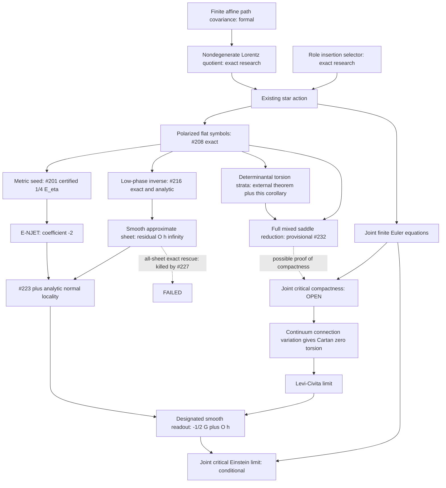

# A4D gravity after #227: critical limits, cyclotomic strata, and the missing compactness theorem

**Task:** `EXP-A4D-DEEP-GRAVITY-SYNTHESIS-BREAKTHROUGH`  
**Execution:** PR #237  
**Launch main:** `597d81757d84a17bde7e34574aacc90c1966fb4f` (#236)  
**Primary scope:** research mathematics; no Lean, action, book, or release changes  
**Terminal:** `A4D-GRAVITY-DEEP-SYNTHESIS-PARTIAL`

## 0. Answer and status

The strongest surviving route is **convergence of joint critical solutions**, through the first variations of the existing star action. In a genuinely smooth connection sector, its connection equation selects the Levi-Civita limit and its metric equation has the coefficient already fixed by #201/#216. Finite connection uniqueness is a sufficient tool, not a necessary conclusion.

The one scientific blocker for this route is:

> **JOINT-CRITICAL-CONNECTION-COMPACTNESS:** derive, from the actual finite joint equations in a stated physical near-flat sector, compactness of the rescaled connection in a topology that permits passing both first variations to the continuum. It must be uniform in refinement and smooth background, after genuine Lorentz gauge. It cannot be supplied by declaring that the connection is smooth.

This is a specific a priori theorem about solutions, not an additional term or selector. Section 7 gives a sufficient, falsifiable version. This memo does **not** prove that theorem. It also does not prove existence of discrete curved joint vacua approximating every continuum solution. The convergence target quantifies over sequences of solutions that exist; existence/evolution is a different assertion.

New results here are:

1. **EXACT / PROVED, using an EXTERNAL THEOREM:** the total canonical-flat source-invisible connection nullity is a quasipolynomial in the torus size, of degree at most three. A finite binomial-coset construction classifies its torsion points in principle. This is an all-refinement structural theorem, **not an evaluated D0 coset list**.
2. **EXACT / PROVED:** even on the diagonal character line, removing exact singular characters does not leave a refinement-independent positive singular-value gap for the stacked connection/metric constraint symbol. At least a polynomial loss must be allowed.
3. **FAILED ROUTE / NO-GO, exact variational control:** degree four and a fixed local stencil do not imply a refinement-independent distance-to-critical-set Hölder exponent.
4. **EXACT / PROVED:** joint stationarity in the genuine Gram section recovers all solder Euler equations through the finite Lorentz Noether identity.
5. **CONDITIONAL THEOREM:** bounded smooth rescaled connections satisfying the literal connection equations converge to Levi-Civita with sufficient derivative control to recover the owned Einstein response. The hypotheses, including the physical readout passport, are stated in §7.

The accompanying [exact checker](certificates/a4d_deep_gravity_synthesis_structure_check.py) checks finite algebraic controls, including the literal zero-phase star mass and the Cartan map. It does not certify the external torsion theorem, an uncomputed resonance cover, or the missing compactness theorem.

## 1. Input ledger and epistemic boundaries

Merged inputs are read at launch main. Live inputs are provisional and pinned; final refresh is recorded in §10. No live input branch is modified.

| Input | Owned result used | Boundary |
|---|---|---|
| #201 | Physical metric Gram lift; exact naked-star Schur Hessian `1/4 E_eta`, all ten momentum coefficients; residual completion has zero flat quadratic jet | Finite seed; not a nonlinear Einstein theorem |
| #208 | Genuine nonlinear Lorentz quotient; **polarized** Laurent connection and mixed symbols; quarter-wave resonance | Withdrawn unpolarized determinants are excluded |
| #216 | Constant-solder low-phase inverse; fixed smooth approximate connection with `E_K=O(h^infty)`; normalized smooth response `-1/2 G+O(h)` under H-REAL/H-STAR | Approximate connection; no all-sheet exact rescue |
| #223 | Normal-coordinate derivative allocation and nonlinear locality | Combinatorial locality, conditional on analytic vertex bounds |
| #225 | Frozen phase detuning adds `6t(ac+bd)` and produces leading roots of size `sqrt(abs(t))` | Phase detuning is not already a theorem for arbitrary slowly varying metric backgrounds |
| #226 | Finite-stencil metric response Lipschitz bound; normalized polynomial loss `h^-2` | Wiener use requires an actual bounded algebra norm, not just pointwise smallness |
| #227 | Exact curved full-lattice `E_K=0` family for every `L=4m`; nonzero metric response | Refutes all-sheet connection-only rescue; **not a joint vacuum counterexample** |
| #228 | Fixed-rank compound affine quotient and rank-two null flag | Finite formal kinematics; no cross-rank invariant or action selector |
| #202 | Full transverse obstruction of the parabolic sheet; later support-seven activation jets | Live lower-wall research, not an upper-wall solution theorem |
| #231 | Intended full mixed census and genuine physical quotient | No scientific artifact available at the pinned startup head |
| #232 | Valuation cases and the full saddle-kernel extension; conditional local joint reduction | Does not establish uniform refinement control |
| #233 | Exact coframe-transport torsion of #227 | Diagnostic, distinct from affine translation/open torsion |
| #234/#235 | Intended residual nonlinear germ computations | No scientific artifacts available at pinned startup heads |

### 1.1 Earlier programme: what cannot substitute for this bridge

The finite affine path composition and covariance are Lean-owned by `D0.Geometry.ArchiveAffineCartanConnection` and related modules. The two-jet energy/cell identities are owned by the modules in `D0-A4D-SECOND-ORDER-ENERGY-COVARIANCE-001`. They do not establish continuum metric dynamics.

The no-go atlas distinguishes trace translation blindness, shared-site coboundary flatness, the narrower Role insertion classification, and the fixed-rank affine residual quotient. The proper Lorentz/Role insertion problem selects the star channel in its stated canonical naturality class. The broad quadratic-action nonselection countermodel has a different admissible class and cannot undo this narrower result.

The registry explicitly classifies `D0-GRAVITY-MACRO-EINSTEIN-INTERFACE-001` as a finite signature aggregator. Its separately sourced symmetry/divergence/TT clauses are not one continuum response operator. `D0-SPECTRAL-EINSTEIN-001` owns conservation of `einsteinResponse L=2L`, a graph Laplacian; it is not a proof about the Einstein tensor. `D0-HODGE-LINKS-001` is still a proof target. None closes the present arrow by a change of vocabulary.

Sources: [claims](../claims.csv), [assumptions](../assumptions.csv), [no-go atlas](../frontier/no_go_atlas.md), [resolved programme](MEMO_A4D_RESOLVED_AFFINE_PROGRAM.md), [target-span audit](MEMO_A4D_DISCRETE_PALATINI_TARGET_SPAN.md). Book 07's macro-gravity discussion is interpreted through these owners and explicit bridge passports, not as an independent missing theorem.

### 1.2 Literal variables and action

Use `eta=diag(1,-1,-1,-1)`, proper Lorentz links `L_r(x)`, and nondegenerate solder legs `v_r(x)`. In the #227 convention, `Theta=eta` gives `v_r=e_r` and `Q=Theta eta Theta^T=eta`. The genuine symmetric lift obeys `delta Q=H eta+eta H^T=q` with `H=q eta/2` for the row-leg perturbation (not the raw Theta perturbation at Theta=eta); arbitrary sixteen-component solder changes are not ten independent metric changes.

The existing action is

\[
 S_\star=\sum_{x,r<s}\epsilon_{rsuv}
 (v_u\wedge v_v)^TG_2\star\mathfrak b(\mathcal C(P_{rs}(x))),
\]
\[
 P_{rs}(x)=L_r(x)L_s(x+hr)L_r(x+hs)^{-1}L_s(x)^{-1},
 \qquad \mathcal C(P)=\tfrac12(P-P^{-1}),
 \qquad \mathfrak b(C)_{ab}=(C\eta)_{ab}.
\]

The mesh notation makes the physical sampling scale explicit; it does not change the dimensionless action. Metric and connection Euler partials are taken before imposing either equation. The final metric readout uses `h^-2` and the E-RECON/E-NJET normal-chart convention. No new coefficient is chosen here.

On the nondegenerate solder section local Lorentz gauge is removed by the genuine quotient, not by dropping all null eigenvectors. A finite lattice translation or a linearized Einstein null vector is not automatically an exact diffeomorphism gauge transformation.

## 2. Dependency graph

Edges into COMP are **HYPOTHESIS**. `COMP -> CART -> LC` is a **CONDITIONAL THEOREM** with the smooth hypotheses of §7. `E -> NJ -> SEED` retains the physical realization/readout passport. The torus-stratum arrow is **EXTERNAL THEOREM + EXACT / PROVED application**, and does not imply COMP. The dashed rescue arrow is **FAILED ROUTE / NO-GO**.

## 3. Two necessary corrections to the proposed target

### 3.1 Prescribed-source response equality is exact and uninformative about Einstein

**EXACT / PROVED.** If both branches have the same prescribed source and satisfy

\[
 E_Q(Q_h,K_h^{(j)})=\kappa T_h,\quad j=1,2,
\]

then their raw metric responses are exactly equal. The difference vanishes before normalization or a limit. In vacuum it is exactly zero as well. This cannot identify their common value with `-1/2 G[Q]`, or imply `G[Q]=0`. An identically zero action is an abstract hostile control: its joint responses coincide for every metric without imposing Einstein's equation.

If matter's metric response depends on the connection, equality of sources is a separate hypothesis. No matter stress or spin-current theorem is imported here.

The substantive replacement is **consistency of the geometric response along solutions**:

\[
 h^{-2}R_h^{\rm phys}(E_Q(Q_h,K_h))
 \longrightarrow -\tfrac12G[g].
\tag{3.1}
\]

Together with a prescribed normalized source limit, this gives the corresponding Einstein equation. For vacuum it gives `G[g]=0`. Existence of finite branches is not furnished by comparing two branches.

### 3.2 The tangent cone is not unconditionally N0

**EXACT / PROVED, already owned by live #232.** `E_Q(q,0)=0` implies `H_QQ=0` and `E_Q(q,a)=Ca+O(qa,a^2)`. Let the first connection order be `p` and metric order `r`, with source order greater than `p`.

- `p<r`: the leading connection coefficient is in `ker A intersect ker C`.
- `p=r`: it lies in the **full mixed** kernel through `A a_p+B q_p=0`, `C a_p=0`.
- `r<p`: earlier metric solvability and nonlinear forcing must be examined; the first connection coefficient need not solve `A a_p=0`.

Thus the dispatch sentence about every germ starting in N0 needs its connection-leading qualification. Puiseux valuations preserve the same comparison; nonsmooth solution families need a separate argument.

For `A=H_AA`, `B=H_AQ`, `C=H_QA`, live #232 constructs `M0=ker(pi B)` and `Sigma(q)=[C v_R(q)] mod C(ker A)`, where `A v_R=-Bq`. Its exact kernel extension is

\[
 0\longrightarrow N_0\longrightarrow\ker\mathcal H_J
 \longrightarrow\ker\Sigma\longrightarrow0.
\]

The mixed/metric-only part is not expendable. This memo uses that result and does not redo the delegated census or nonlinear germs. Finite Lyapunov-Schmidt reduction acts on the genuine full joint kernel, and its codomain is the genuine joint cokernel.

## 4. New all-refinement theorem: cyclotomic determinantal strata

### 4.1 Statement and verified hypotheses

Fix the **canonical constant** flat solder and the correctly polarized owner of #208/#216. Let `H(z)` and `C(z)` denote the connection Hessian and metric constraint on a connection amplitude with the same polarization. Define the stacked symbol

\[
 T(z)=\begin{pmatrix}H(z)\\C(z)\end{pmatrix},\qquad
 d(z)=24-\operatorname{rank}T(z),\qquad
 D(L)=\sum_{z\in\mu_L^4}d(z).
\]

One concrete owner convention is the transpose of the augmented matrix `[HAB(z)^T | HAQ(z)]` in the #216 certificate: `T=[HAB; HAQ^T]`. Here `z` labels the **test** character and its state amplitude has character `z^-1`. Relabeling all characters by inversion leaves `D(L)` unchanged. This prevents an unpolarized mixed block from entering the argument.

**EXACT / PROVED with an EXTERNAL THEOREM.** There are finitely many integers `c_alpha`, positive integers `M_alpha`, and dimensions `0<=d_alpha<=3`, independent of `L`, such that

\[
 \boxed{D(L)=\sum_\alpha c_\alpha L^{d_\alpha}
                   \mathbf1_{M_\alpha\mid L}.}
\tag{4.1}
\]

Consequently `D(L)` is an exact quasipolynomial, `O(L^3)`. It is bounded for all refinements **if and only if** the torsion closure of every nonempty positive-nullity stratum has dimension zero. A positive-dimensional torsion coset produces unbounded nullity along multiples of its order.

The Laurent property is verified from the literal polarized stencil: finite shifts contribute monomials, inverse test characters give negative exponents, and canonical generators, Gram lift, `G2` and star signs have rational entries. No `L` occurs in these coefficients. `H(1)` is invertible, with determinant 256. Thus all positive-nullity varieties below are proper.

### 4.2 Proof

For `j=1,...,24`, let

\[
 V_j=\{z\in(\mathbb C^\times)^4:\operatorname{rank}T(z)\le24-j\}.
\]

It is defined by the `(25-j)`-minors of T. Pointwise `d(z)=sum_j 1_{V_j}(z)`, so `D(L)=sum_j #(V_j intersect mu_L^4)`.

The external torsion theorem says the torsion points of an algebraic subset of a complex torus lie on a finite union of torsion translates of connected subtori contained in that subset. Its count formulation and connected-component/intersection treatment are stated in Hironaka, Theorem 1 and §1; her Theorem 2 gives effective support-based bounds over Q. [Primary source](https://arxiv.org/abs/alg-geom/9607014).

For a connected coset `xi P` of dimension d, let M be the order of its class in the quotient torus. Split the saturated character lattice using an integral basis. The coset meets `mu_L^4` iff `M|L`, and then its intersection is a translate of `P[L]`, with `L^d` elements. Intersections of finitely many cosets are empty or finite disjoint unions of connected torsion cosets. Inclusion-exclusion gives (4.1). Every such coset is inside a proper `V_j`, hence has dimension at most three.

If all cosets have dimension zero the counts are bounded. Conversely a d-dimensional coset with d>0 contributes at least `L^d` to some `#V_j` along `M|L`; the counts are nonnegative, so cancellation in a chosen inclusion-exclusion presentation cannot remove this growth. This proves the boundedness criterion.

For real lattice fields, conjugate character pairs must be assembled. The sum over **all** characters is the dimension of the complexification of the real kernel, and therefore equals its real dimension; there is no extra global factor of two.

### 4.3 A finite exact classification procedure, not a completed classification

For each stratum clear Laurent monomial denominators in its nonzero minors. A torsion zero of a rational polynomial admits a partition of its nonzero monomials into minimal vanishing rational sums. For a block of size R, Mann's ratio bound forces the ratios of the root-of-unity monomial values to have order dividing the product of primes at most R. Enumerate support partitions and these finite ratios; retain exactly the assignments whose rational weighted sums vanish. Each assignment gives binomials `z^(lambda-lambda0)=eta_lambda`. Smith normal form resolves their consistency and connected components. Intersect the covers for the defining minors.

This is a finite exact cover of **all root-of-unity zeros**, because every torsion zero yields such a partition, and every retained binomial solution makes every polynomial vanish. The ratio bound is proved in Hironaka, Proposition 4.3. No numerical root search is required by this construction. Its cost can be enormous; this memo has **not** enumerated the D0 minors' cover.

### 4.4 What the theorem changes and does not change

It replaces the belief that infinitely many lattice sizes necessarily require independent scans with a fixed algebraic classification problem. It does **not** establish:

- that the actual D0 torsion cosets have dimension zero;
- that the L=4 list exhausts larger refinements;
- that the full mixed physical kernel has bounded dimension;
- a lower bound on nearly singular characters;
- uniformity under variable metric coefficients or slowly varying backgrounds.

One coset `z0=i` already contains `L^3` characters when `4|L`. A finite number of coset **types** is not a finite-dimensional Kuranishi theorem. Across arbitrary coefficient parameters even `z-a=0` can have torsion points of unbounded order as `a` varies on the unit circle. That is a general parameter-family control, not a counterexample within D0's restricted solder family.

### 4.5 Exact obstruction to a constant gap after deleting exact resonances

The owned diagonal formula is

\[
 \det H(t,t,t,t)=\frac{(t^2+1)^{12}}{16t^{12}}.
\]

At `t=i`, `rank T=20`, so take a unit vector in its kernel. For `L=4m`, the adjacent diagonal lattice character is `t_L=exp(i(pi/2+2pi/L))`. It is not `+i` or `-i`; H and hence T are full column rank there. But the fixed Laurent symbol is Lipschitz on the compact torus, so

\[
 \sigma_{\min}(T(t_L,t_L,t_L,t_L))\le C/L.
\tag{4.2}
\]

Thus no positive L-independent gap remains after deleting only exact singular characters. This is an actual D0 result from the corrected owner. It does **not** prohibit `h^-p` losses, nor establish their sufficient exponent. A fixed neighborhood of the complete real singular variety can have a compact-complement gap; deleting a shrinking or merely exact set is a different assertion.

## 5. A variational no-go for the fixed-degree shortcut

**EXACT / PROVED; not a D0 joint-vacuum no-go.** For n variables define

\[
 S_n(x)=\tfrac12\sum_{i<n}(x_i^2-x_{i+1})^2+\tfrac12x_n^4.
\]

This has degree four and a fixed nearest-neighbor stencil. Its gradient has degree three. Put `w_i=2^(i-1)`, `R_i=x_i^2-x_(i+1)` and `R_n=x_n^2`. Weighted Euler differentiation gives

\[
 \sum_i w_i x_i\partial_iS_n=\sum_i2^i R_i^2.
\]

Therefore every real critical point has `R_i=0` for all i and hence x=0. The critical zero is isolated globally.

Along `x_i=t^(2^(i-1))`, all but the terminal residual vanish and

\[
 \nabla S_n=(0,\ldots,0,2t^{3\,2^{n-1}}),\qquad \|x\|\ge|t|.
\]

A local bound `||x||<=C_n ||grad S_n||^beta` forces

\[
 \beta\le\frac1{3\,2^{n-1}}.
\]

There is no uniform positive beta, even allowing the prefactor to depend on n. Clearing local rational denominators cannot bypass this dimension issue; eliminating regular variables can further increase algebraic complexity. A valid uniform isolation theorem needs a bounded effective dimension or a stronger structural estimate on coupled modes.

The checker verifies the identities for n=1,...,8. The displayed weighted identity and curve prove the general statement for all n; eight checks alone are not that proof.

## 6. Competing architectures and their kill-tests

| Architecture | Sufficient mechanism | Kill-test and verdict |
|---|---|---|
| Off-shell single-valued elimination `K_*(Q)` | Unique physical connection response on all stationary sheets | #227 kills it already at fixed flat Q; FAILED |
| Uniform joint Kuranishi theorem | Full physical joint kernel, regular inverse with polynomial losses, nonlinear normal estimate uniform in background and refinement | Mixed kernel extension, positive-dimensional torsion cosets, near-resonances, #225 unfolding and §5 defeat the proposed shortcuts; CONDITIONALLY VIABLE |
| Mixed inf-sup theorem | Joint saddle inverse after retaining physical IR; constraint-kernel invertibility and a quantitative constraint bound | `C|ker A` alone misses metric-only/mixed nulls; Lorentzian A is indefinite; (4.2) kills a constant gap after exact-point deletion; CONDITIONALLY VIABLE |
| Response-null moduli / universality | Compare with the designated smooth response, or prove a geometrically defined UV defect is response-null | Same prescribed-source branch comparison is tautological (§3.1); no nontrivial all-sector defect theorem is owned; INCOMPLETE |
| Critical-sequence convergence | First-variation consistency plus endogenous compactness of solutions | Values-only/Γ-convergence does not transfer critical points; #227 defeats connection-equation-only compactness at the required derivative level; STRONGEST SURVIVING ROUTE |
| Holonomy-rank compounds as a universal resonance selector | Identify local holonomy ranks with the joint Bloch singular strata | Same flat `P=I` has rank-24 H at z=1 and rank-16 H at z=i; local compounds all vanish in both cases; FAILED as a standalone classifier |

These routes address different mathematical objects. A Kuranishi or inf-sup theorem can prove the missing compactness lemma, but neither must end in uniqueness of every finite link field. The cyclotomic theorem tells which exact resonance geometry any such proof must confront.

### 6.1 The precise saddle condition

For the real lattice Hessian in a fixed genuine quotient write

\[
 \mathcal H_J=\begin{pmatrix}0&B^*\\B&A\end{pmatrix},
\]

where the adjoint refers to the stated positive comparison norm, not to a claim of positive Lorentzian energy. Set `V=ker B*`. A finite invertible saddle operator requires the compression `P_V A|V` to be invertible and B to have a lower singular-value bound on the metric quotient being constrained. For uniform estimates, record both inverse constants and projection norms with their allowed powers of h. If physical metric/IR nulls remain, apply the condition to an explicitly defined complementary slice.

The restriction `C|ker A` measures which zero directions of A the metric equation sees. It is a useful rank test; it is **not** the complete saddle inf-sup theorem. The Schur quotient Sigma in §3.2 contains the missing mixed compatibility. Ordinary positive-energy coercivity cannot be assumed for this Lorentzian action.

### 6.2 Exact finite gauge-completion lemma

**EXACT / PROVED.** On a nondegenerate solder chart of a genuinely Lorentz-invariant finite action, vanishing of all link Euler equations and the ten independent Gram-metric partials implies vanishing of **all sixteen solder partials**.

Proof: the differential of the Gram map is surjective with six-dimensional kernel equal to the tangent of the local Lorentz orbit. Differentiate finite gauge invariance at each site. Its Noether identity equates the vertical solder partial to a linear combination of the incident link partials. With every independent link partial zero, the vertical partial is zero. A genuine metric section spans the ten horizontal directions; its partials together with the vertical directions span the solder tangent. All solder partials vanish. The converse is immediate for such a section.

This supplies the coframe variation needed in a continuum Palatini limit without pretending that metric-only variation is already the full tetrad equation off shell. It uses the actual finite gauge group, and does not manufacture diffeomorphism gauge.

## 7. Strongest route: first variations and critical compactness

### 7.1 Conditional smooth-critical theorem

**CONDITIONAL THEOREM; analytic argument, not Lean-owned.** Work on an interior local chart (or periodic carrier), retain the existing action and the #216 H-REAL/H-STAR response passport. Let sampled nondegenerate coframes `E_h` converge to E in C3, in a compact chart with bounded inverse. Write

\[
 L_{h,r}(x)=\exp(h\omega_{h,r}(x)).
\]

Assume these are samples of connection fields with uniform C2 bounds. Assume every independent edge Euler equation vanishes. Then on compact subcharts

\[
 \omega_h-\omega_{\rm LC}(E_h)=O(h)\quad\text{in }C^1
\tag{7.1}
\]

in the sense of nodal values and finite differences, and the normalized physical metric partial obeys

\[
 h^{-2}R_h^{\rm phys}E_Q(Q_h,K_h)
       =-\tfrac12G[g_h]+O(h).
\tag{7.2}
\]

If the metric equation is also the vacuum equation, every smooth metric limit satisfies `G[g]=0`. For a prescribed spin-independent source with the same owned physical readout and normalized limit `h^-2 R_h T_h -> T`, the limiting equation is `-1/2 G= kappa T` in this normalization. This statement does not select the physical value of kappa or derive a matter coupling.

A weaker convergence conclusion, without rate, only needs precompactness of `omega_h` in C1 and sufficient convergence of E_h. Uniform C2 is a convenient sufficient condition for the rate; it is **not a consequence of the finite equations established here**.

### 7.2 Proof decomposition

**L1 — actual finite variations first.** Vary every link in the sum, including all shifted occurrences and inverses. This gives a fixed local stencil. Identity

\[
 D\mathcal C_P[\delta P]=\tfrac12(\delta P+P^{-1}\delta P P^{-1})
\]

keeps the nonlinear derivative exact. Use the gauge-completion lemma for the solder variation on joint critical solutions. Restricting the action to a period-four ansatz and differentiating its few parameters would not give L1.

**L2 — smooth stencil expansion.** Taylor-expand the actual finite shifts and exponentials on the compact coframe/connection chart. The plaquette expansion is

\[
 \mathcal C(P_{rs})=h^2
   (\partial_r\omega_s-\partial_s\omega_r+[\omega_r,\omega_s])+O(h^3).
\]

The literal density therefore has the tetradic Palatini leading form, with the same star/orientation normalization. Expanding the already-varied link stencil gives

\[
 h^{-1}E_K=\mathcal J_E(\omega)+O(h),
 \qquad \mathcal J_E(\omega)=\mathcal M_E
           (\omega-\omega_{\rm LC}(E)).
\tag{7.3}
\]

The leading continuum connection variation is `epsilon D(e wedge e)=0`. Nondegenerate E and Lorentz-valued omega make it equivalent to Cartan zero torsion. It is obtained from the action, not imposed on the finite theory. The finite stencil size and compact denominator margin make these Taylor constants independent of the number of cells. With E in C3 and omega in C2, the remainder in (7.3) also has the first-derivative control used below.

**L3 — algebraic Cartan invertibility.** For E=I, the map

\[
 \omega\mapsto(T_{rs}=\omega_r e_s-\omega_s e_r)
\]

is an invertible 24-by-24 map. In index form, a lowered metric-compatible connection difference is antisymmetric in its internal pair; zero torsion makes the other pair symmetric. Cycling the three indices gives the tensor equal to its negative, hence zero. Changing an invertible coframe transports this isomorphism. The associated connection Euler mass is also invertible: its literal canonical zero-phase determinant is 256. The #216 constant-solder congruence supplies compact-chart quantitative bounds. This is an algebraic mechanism independent of the global Bloch gap.

**L4 — selection with one derivative.** At nodes, the exact edge equations and (7.3) give `J_E(omega_h)=O(h)`. Take neighboring differences of the exact zero equations. The C1 remainder bound gives `D_h J_E(omega_h)=O(h)`. Uniform C2 control of J converts these differences to its first derivative with error O(h). Apply the smooth compact-chart inverse of M_E and differentiate it to obtain (7.1). This step is needed: raw #226 sensitivity alone turns an O(h2) error in dimensionless log links into only O(1) after normalization.

**L5 — curvature and response.** C1 closeness of omega controls `d omega+omega wedge omega`. The plaquette expansion and the finite metric variation then converge to the Palatini metric partial at Levi-Civita. In the owned normal-chart readout, #201 fixes its coefficient to `1/4 E_eta`; E-NJET gives `E_eta=-2G`, hence `-1/2 G`. #223/#216 control the complete smooth remainder rather than only its linear coefficient. The normal-chart physical reconstruction remains an explicit H-REAL/H-STAR hypothesis; an arbitrary raw density is not silently identified with a covariant tensor.

This proof is a conditional route through the **actual** stencil. The smooth bounds are its input. It does not turn #216's small residual into an exact root or demand an off-shell connection map.

### 7.3 The one missing endogenous lemma

Here is a concrete sufficient target, stronger than response consistency but independently testable:

> On the genuine near-flat physical quotient, let `Q_h` have smooth nondegenerate coframe realizations converging in C3, and let exact **joint vacuum** solutions have log links `A_h -> 0` in the local chart. Prove that the rescaled connections `A_h/h` have a representative precompact in C1 on compact subcharts, uniformly under refinement and the allowed smooth backgrounds.

Boundedness of `A_h/h`, suppression of grid-scale oscillations, and compatibility of local representatives are conclusions required of this **one compactness lemma**. They are not inferred from `A_h -> 0`. Once it holds, §7.2 with little-o remainders gives the vacuum Einstein limit. The stronger C2 estimate supplies an O(h) rate. A counterexample consisting of response-null rapid moduli would refute this sufficient compactness target while leaving a weaker defect-only Einstein theorem possible; it would require weakening the route explicitly.

The structural results of §4 and the local workers are tools for proving or disproving this lemma. They are not a list of independent closure obligations. A fixed-size Kuranishi theorem is only one possible method. No conclusion here says that every issue in the entire D0 programme, including realization or matter existence, is downstream of this lemma; the claim is relative to the stated vacuum convergence target and existing realization passport.

## 8. Hostile controls and the two walls

| Control | Consequence for the strongest route |
|---|---|
| #227, `t=h2` | `omega=A/h=O(h)` in value, but its grid-scale derivatives do not have the needed equicontinuity: second derivatives grow like `h^-1`. `E_K=0` alone does not imply critical compactness. `E_Q` is nonzero, so this is not a counterexample to the joint-vacuum lemma |
| #227, `t=h3` | Smoothness-compatible derivative size no longer gives a nonzero normalized metric limit: the raw normalized response is O(h). Amplitude and derivative scaling must both be checked |
| #225 | Rank-changing unfoldings can create roots of size `sqrt(abs(t))`. A frozen isolated germ is not stable uniformly through this parameter. It remains a phase-detuning control unless slow metric realization is proved |
| `u3-hu` | At zero source there are branches `u=+-sqrt(h)`. Fixed degree, finite dimension, and a frozen isolated zero at h=0 do not control distance to the designated zero uniformly |
| Quarter-wave invisible modes | Their actual nonlinear coupling is delegated; their presence cannot be called gauge or response-null by rank counting |
| Both one-dimensional sectors and diagonal sector | Pending #234/#235; this memo neither assumes isolation nor reproduces their calculations |
| Larger L | Exact nullity may grow on torsion cosets; almost resonant characters already destroy a constant gap by (4.2) |
| Smooth low-frequency modulation | It couples Bloch blocks and changes local rank strata. Constant-background torsion counts and a pointwise low-phase inverse do not constitute a global coupled estimate |
| Genuine gauge | Six solder orbit directions are removed by the actual quotient; physical IR/mixed directions must remain unless their nonlinear gauge action is owned |
| Values-only variational convergence | `F_h(x)=x+2h sin(x/h)` converges uniformly to x, but has critical points `x_h=2pi h/3 ->0`; the limit function is not critical there. First variations need their own convergence |

### 8.1 Torsion: the exact diagnostic and its limitation

For #227's period-four family, let `D=4-3t2`, `c=4t/D`. Coframe transport torsion is

\[
 T_{rs}=L_rv_s(x+hr)-v_s(x)-L_sv_r(x+hs)+v_r(x).
\]

At even phases, `T_0s=+-c e0+(2t2/D)(e1+e2+e3)`, with the quadratic term having the **same** sign at both even phases. At odd phases torsion is zero although curvature and the metric partial are nonzero. Spatial faces vanish. Global torsion vanishes only at t=0 on this family. These are the exact #233 formulas; placing the sign outside the entire vector would be incorrect.

The affine open-translation defect is identically zero when the translation labels are zero; it is a different object. Local vanishing of the coframe diagnostic does not select #227 away. Global zero torsion would remove that family, but manually imposing it is outside the task. The continuum Cartan conclusion in §7 is endogenous **after** the first-variation limit; no exact finite implication `joint equations => T_rs=0` is proved here.

### 8.2 Lower wall, compound quotients, and a typed separation result

#228 represents `[t] in coker M` at exactly rank r by `Psi_r(M,t)=t wedge Lambda^r M`. It is translation-shift invariant at that rank, and its zero test/equality test is exact. Below that rank it vanishes for every t; above that rank the same shift invariance need not hold. It is therefore a rank-stratified diagnostic, not a globally available scalar action term.

#202's rank-two parabolic holonomy carrier makes determinant and adjugate blind, yet independent transverse Euler derivatives can remain nonzero. Its later seven-support jets activate cofactors at first order and residuals at second order without making the base critical. A unit Newton displacement is not a germ through a stationary point; the constant Euler defect cannot be canceled by a formal infinitesimal coefficient.

**EXACT separation.** At the canonical flat configuration `P=I`, all positive-degree compounds of `I-P` vanish. At that same configuration the connection symbol is invertible at z=1 and singular at z=i. Therefore local holonomy ranks/compound values **alone** cannot classify UV Euler resonances. The lower-wall internal four-dimensional holonomy map and the upper-wall 24/34-dimensional symbol have different domains, codomains, and variation content.

They share a useful language—rank, image, cokernel, transverse equations, and singular strata. An actual identification would require a typed map intertwining their Euler derivatives, which is not owned. The compound construction can be applied to a symbol's own minors as a diagnostic; using `Lambda^r(I-P)` in their place has no proof. No new invariant is inserted into the action.

## 9. Primary literature and transfer audit

These sources supply methods with hypotheses. None supplies the missing D0 compactness estimate. URLs point to primary papers or their publishers. The original Regge (1961) publisher record was accessible, but its full text was not; the substantive first-order Regge analysis below uses Barrett's accessible original paper.

| Technology and primary source | Actual hypotheses/content | D0 transfer: owned and missing |
|---|---|---|
| Tetradic Palatini / Cartan mechanism: [Kur & Glasser (2022), §§II, III](https://arxiv.org/abs/2202.02486) | Independent nondegenerate tetrad and Lorentz connection; spin-free vacuum variation gives `epsilon D(e wedge e)=0` and the tetrad curvature equation | Lorentz-valued links and independent solder are present. The leading-form argument is useful. Their edge Poincare translation is a path-integrated coframe and their cell symmetrization differs from the D0 density. Their discrete equations cannot be copied as D0 theorems; solution compactness remains missing |
| First-order Regge: [Barrett (1994), first-order and independent-angle sections](https://arxiv.org/abs/hep-th/9404124) | Nondegenerate simplex geometry, compatible dihedral angles, Schläfli identity; local area-to-length invertibility near equilateral positive metrics. Extra stationary points can arise outside that local region | Useful warning: a first-order extension and the correct second-order seed do not establish global equivalence. D0 lacks the simplex-angle carrier/constraint map; no Regge selector or multiplier is imported. Original context: [Regge (1961)](https://doi.org/10.1007/BF02733251) |
| Saddle stability: [Brezzi (1974), Theorem 1.1 and Proposition 1.1](https://www.numdam.org/item/M2AN_1974__8_2_129_0/) | Continuous bilinear forms on Hilbert spaces; inverse on the constraint kernel and adjoint inf-sup condition, with explicit inverse dependence | Finite spaces and a genuine saddle Hessian exist. Uniform physical quotient, kernel compression inverse, and quantitative mixed bound are not established. Positive coercivity is sufficient in a corollary, not necessary in the main theorem, and is not assumed for D0 |
| Lyapunov-Schmidt / analytic Fredholm / Łojasiewicz-Simon: [Feehan & Maridakis, Theorem 1, Lemma 2.10, Definition 2.11](https://arxiv.org/abs/1510.03817) | Analytic functional on a Banach space embedded in Hilbert space, critical point, Fredholm Hessian of index zero. Local reduction yields a finite-dimensional analytic function; a Morse-Bott critical manifold gives the optimal gradient exponent | At each fixed finite L, analyticity and finite-dimensional Fredholmness hold in a valid chart. Uniform complement inverse, dimension and neighborhood, and a fixed limiting Fredholm realization are absent. The gradient inequality compares energy and gradient; a distance estimate is a further statement. No ellipticity is imported from their geometric applications |
| Equivariant bifurcation: [Chossat & Golubitsky (1988), equivariant branching lemma](https://www.asc.ohio-state.edu/golubitsky.4/reprintweb-0.5/output/papers/iterates_88.pdf) | Compact group, appropriate irreducible representation, simple parameter crossing, one-dimensional fixed-point sector | Finite Role/permutation symmetries can supply a compact group on a verified normal germ. Absolute irreducibility and crossing hypotheses must be checked. Local Lorentz gauge is noncompact and is not that group. #225 suggests unfolding, not an automatic uniqueness theorem |
| Effective polynomial gradient inequality: [D'Acunto & Kurdyka (2005)](https://impan.pl/en/publishing-house/journals-and-series/annales-polonici-mathematici/all/87/0/84774/explicit-bounds-for-the-lojasiewicz-exponent-in-the-gradient-inequality-for-polynomials) | Real polynomial of degree d in n variables, vanishing value and gradient at the origin; bound uses `R(n,d)=d(3d-3)^(n-1)` | Fixed finite charts permit polynomial controls after legitimate denominator clearing. The dimension dependence is decisive; it does not yield a uniform beta on growing lattices. The separate distance-to-zero problem and parameter degeneration remain. Section 5 supplies a direct variational hostile control |
| Bloch-Floquet algebra: [Kuchment (2016), §5.7](https://arxiv.org/abs/1510.00971) | Fixed periodic finite-range difference operators have matrix Laurent symbols and algebraic Floquet varieties | Applies to the canonical flat translation-invariant operator. Slowly varying backgrounds couple characters and require a separate estimate. Self-adjoint elliptic spectral-edge conclusions in other parts of the source are not assumed for the Lorentzian joint system |
| Torsion geometry of rank strata: [Hironaka (1996), Theorems 1–2 and Proposition 4.3](https://arxiv.org/abs/alg-geom/9607014) | Algebraic subsets of a complex torus; rational equations permit an effective support/ratio method | Applies to the fixed canonical rational Laurent minors, giving §4. It neither evaluates this model's coset cover nor controls almost resonances or parameter-uniform rank changes |
| Variational critical limits: [Sandier & Serfaty (2004), abstract theorem and introduction](https://math.nyu.edu/~serfaty/gl9bb.pdf) | Γ-convergence plus gradient/slope and trajectory lower bounds, compatible Hilbert gradient structures, and preparation hypotheses | Supports requiring first-variation information beyond action values. D0 has neither a positive coercive gradient-flow structure nor the needed compactness/preparation theorem. Their flow theorem does not directly prove convergence of Lorentzian saddle critical points. Section 7 instead uses first-variation consistency on actual solution sequences |
| Quantitative singularity methods: [Yomdin (2005)](https://www.impan.pl/shop/en/publication/transaction/download/product/84792) | Quantitative normal forms require bounds on nondegeneracy and coordinate transformations, with explicit jet data | Suggests what a useful rank-stratified normal bundle certificate must record. D0 has exact local charts and finite jets, but not those uniform constants through changing rank. A named normal form alone does not provide them |

The continuum metric-affine Palatini problem allows projective freedoms and differs from the Lorentz-compatible tetradic problem. The mechanism used here is the latter: an invertible coframe and a Lorentz connection, with torsion eliminated by its variational equation in the smooth limit. Spin-coupled matter would change that equation and cannot be treated as spin-free by convention.

## 10. Reproducibility, input refresh, and handoff

### 10.1 Consumed exact versions

| PR | Consumed version | Status at source read |
|---|---|---|
| #201 | merge `197896dbbafebc965d87e56420999350d609cf5a` | MERGED |
| #208 | merge `deb05e05f66bdf2cb3b65db7ba3a9fd08c4acd4f` | MERGED |
| #216 | merge `5523d8f679c1ea02f9b73d757c81649740010d0a` | MERGED |
| #223 | merge `25de48600cbc7c06e233d7b8f886f89566bdd6a4` | MERGED |
| #225 | merge `8639bcde495966629990772867b0d0e9e7de4635` | MERGED |
| #226 | merge `4b145afe33b2fb7381615199167608b71457d01d` | MERGED |
| #227 | merge `245095f941a047dec95877ef03996742f37cb429` | MERGED |
| #228 | merge `966e280f81d5d3e27d8715dd5fdc98f3c3e9b35d` | MERGED |
| #202 | head `a736f21fa94441aa85b922969e739a3e13334bc3` | OPEN, provisional |
| #231 | head `d2f7738ce58a528e86452278c12e6559afda1174` | OPEN, no scientific artifact |
| #232 | head `6482543d98dc1f3c12741c3a44993d140ce9ca32` | OPEN, provisional |
| #233 | head `743096576c27b6c24156c38c96746bef0a77627b` | OPEN, provisional |
| #234 | head `8e91417e6dc4ff748ed31f7dfee2ef21785547de` | OPEN, no scientific artifact |
| #235 | head `2c2f99048527bad523ce9948ca3168860782f5a3` | OPEN, no scientific artifact |

The #202 support-seven first-order and matched-affine second-order certificates were read as activation and nonstationary-base controls. Their newer source does not establish a full affine/Lorentz stationary witness. #232's integration certificate checks its abstract glue and provisional rank arithmetic; it does not replace #231's missing full census. No unavailable worker result is used as a theorem.

Final-main refresh and validation results are appended below before REVIEW.

### 10.2 What to certify/formalize next, without spawning tasks here

The stable finite statements immediately suitable for CONTROL's formalization decision are the gauge-completion lemma (§6.2), the explicit Cartan linear isomorphism (§7.2 L3), and the general fixed-degree variational hostile control (§5). The checker already supplies the canonical ranks, determinant, horizontal/vertical dimensions and exact chain identities.

The global counting theorem can be formalized as a generic consequence of a supplied torsion-coset cover. A complete Lean proof of Laurent/Mann is a substantially different obligation; treating that external theorem as already in core would hide it. A future exact D0 coset cover should record the actual binomials, connected components, orders and rank multiplicities. It is recommended work, not a completed certificate or a newly registered child task.

The immediate scientific decision is whether to attack **joint critical compactness** through the mixed symbol and its nonlinear coupled defect, or find an exact joint-critical sequence refuting that sufficient target. Neither an extra action term nor a manually imposed zero-torsion constraint is called for by this memo.

### 10.3 Recommended wording repairs

These are recommendations; no public/book/claim rows are edited here.

1. Replace “connection stationarity selects the physical response” with a target for **joint critical sequences in a stated realization and physical sector**.
2. Preserve `S_STAR-CARRIES-EINSTEIN-SEED` as an exact finite seed. Do not call it the full Einstein bridge.
3. State the connection-leading valuation hypotheses before placing a germ in N0. Retain the full mixed kernel extension.
4. Replace “finite resonance types imply finite obstruction dimension” with the torsion-coset dimension criterion (4.1).
5. Replace “fixed rational degree yields uniform isolation” with a dimension- and parameter-dependent claim; cite §5 as the hostile control.
6. Replace prescribed-source branch “response universality” with consistency of the geometric response with the owned continuum tensor.
7. Label #225 as a proven phase-detuning leading germ; reserve arbitrary slow-background language for its actual realization/coupling theorem.
8. Keep coframe transport torsion and affine open-translation torsion distinct. Preserve the same-sign quadratic term in #233.
9. Use compounds as diagnostics on the specified rank stratum. Do not identify holonomy and Bloch-rank strata without a typed variation map.

### 10.4 Final scientific verdict

**Terminal:** `A4D-GRAVITY-DEEP-SYNTHESIS-PARTIAL`.

The endogenous mechanism visible in the current action is its **pair of Palatini first variations**: the smooth-limit connection variation eliminates torsion and selects Levi-Civita; the metric variation then carries the already fixed Einstein coefficient. The finite Lorentz Noether identity supplies the full solder equation on joint critical solutions. This removes the need to demand a globally unique off-shell connection function.

The exact all-refinement counting theorem and the two structural hostile controls change how uniform closure should be attempted. They do not close it. The one smallest blocker for the selected convergence route is **JOINT-CRITICAL-CONNECTION-COMPACTNESS**, in the precise sense of §7.3. Until the finite joint equations prove that solution estimate, reaching Einstein remains a conditional bridge, not an unconditional derived law.
